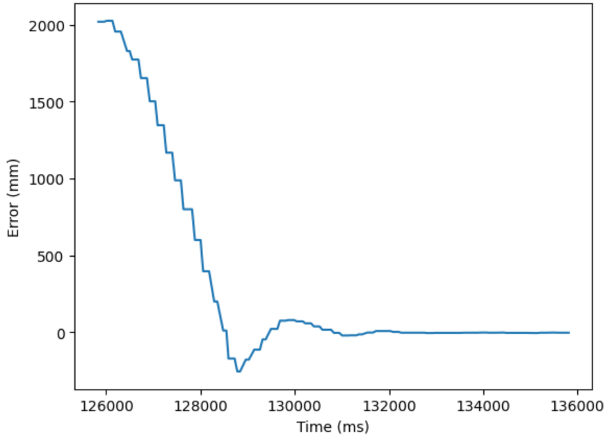
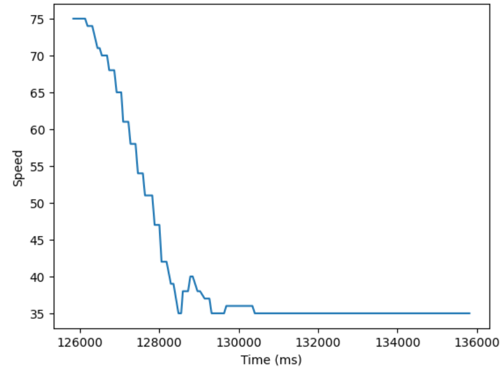

<section id="content">

<h2>Objective</h2>
The goal of this lab was to implement a PID control system to perform a task with the robot car autonomously. The stunt chosen for this lab was to drive towards a wall and stop at a setpoint of 300 millimeters from the wall, as well as to reverse towards the setpoint when the robot overshoots. A PID control system was implemented using distance from the wall data, gathered from the ToF sensors.

<h2>Prelab</h2>
For this lab, it was necessary to integrate various features explored in different labs including bluetooth, the ToF sensors, and motor drivers. First, a bluetooth framework was built based on the code written in Lab 2. New commands were implemented to serve our purposes. The commands include moving and stopping the robot, setting values such as PID gains and the set point, as well as beginning the stunt itself. 

<pre><code>// Bluetooth command types
enum CommandTypes
{
    STOP,
    FORWARD,
    REVERSE,
    LEFT,
    RIGHT,
    TASK,
    SENSORS,
    SET_PID,
    SET_SPEED,
    SET_POINT
};
</code></pre>

Debugging data was send over bluetooth from the Artemis board to the computer, where a Python handler function is used to store the data in various arrays. Time, error (distance from the setpoint), PID value and motor speed were all logged.

<pre><code>#Callback function
def callback(uuid, string_value):
    global string_characteristic
    string_characteristic = ble.bytearray_to_string(string_value)
    str_list = list(map(float, re.findall('-?\d+\.?\d*', string_characteristic)))
    time_list.append(str_list[0])
    error_list.append(str_list[1])
    pid_list.append(str_list[2])
    speed_list.append(str_list[3])
    
ble.start_notify(ble.uuid['RX_STRING'], callback)
</code></pre>

<h2>PID Implementation</h2>
A slow control system with low gain values was preferred to one with overly large gains, since overestimating the necessary gain would result in the robot crashing into the wall. Since the ToF sensor outputs distances in millimeters, gains were kept in the order of hundredths or less so that only larger changes in distance measurements would significantly change the speed of the car. Another design choice was to allow the car to stop within a range of distances near the setpoint. Allowing the car to stop within 1 cm of the setpoint prevents the car from oscillating at a very small amplitude as it attempts to reach an overly exact point that is prone to noise in the ToF sensor readings. The way the task command is set up as follows:

<pre><code>//Task command
if (error > 5)
{
    speed = min_speed + pid;
    if (speed > max_speed) speed = max_speed;
    forward(speed);
}
else if (error < -5)
{
    speed = min_speed - pid;
    if (speed > max_speed) speed = max_speed;
    reverse(speed);
}
else
{
    stop();
}
</code></pre>

The value of <i>error</i> is updated rapidly, and is defined as the difference between the distance sensor reading and the setpoint. When <i>error</i> is positive, the car is further than the setpoint and will thus move forward at a specified <i>speed</i>. When the <i>error</i> is negative, the car is closer than the setpoint and will reverse in order to reach the setpoint. If the car is within 1 cm of the setpoint, it will stop moving. The speed has a lower bound at <i>min_speed</i>, which was determined experimentally to be the smallest PWM value that will keep the wheels turning. Similarly, the speed has an upperbound of <i>max_speed</i> as the PWM signal can not reach above a value of 255. After a period of time, the task is ended regardless of the result in case something goes horribly wrong.

<pre><code>//PID controller
dt = millis() - last_time;
error = distance1 - point;
integral = integral + (error * dt);
derivative = (error - prev) / dt;
pid = Kp * error + Ki * integral + Kd * derivative;
prev = error;
last_time = millis();
</code></pre>

In the above code snippet, the positional term of the controller involves multiplying a gain <i>Kp</i> by the position of the car in relation to the setpoint, stored as the <i>error</i> variable. The <i>integral</i> term uses past values of the error, integrates them over time and multiplies by a <i>Ki</i> gain value. Finally, the <i>derivative</i> term amplifies or dampens the PID controller based on the current rate of change, and is controlled by the <i>Kd></i> term. The first step was to fine tune the values of the PID controller. 

To start, a positional gain factor Kp was determined experimentally. This gain was increased until the car began to oscillate upon reaching the set point, at around Kp = 0.04, then decreased by a factor of 2 to Kp = 0.02. Next, Kd was increased until 0.01, which served to stop the oscillation and smoothen the deacceleration of the car as it approached the set point. Including a Ki greater than 0 caused the car to accelerate uncontrollably, so only PD control was implemented for now.

<h2>Stunt Demonstration</h2>

<iframe width="320" height="560" src="https://www.youtube.com/embed/-n7pEaCChHQ" title="ECE 4160 Lab 6: Stunt 1" frameborder="0" allow="accelerometer; autoplay; clipboard-write; encrypted-media; gyroscope; picture-in-picture; web-share" allowfullscreen></iframe>

<iframe width="320" height="560" src="https://www.youtube.com/embed/CzrMJHkSNus" title="" frameborder="0" allow="accelerometer; autoplay; clipboard-write; encrypted-media; gyroscope; picture-in-picture; web-share" allowfullscreen></iframe>

<iframe width="320" height="560" src="https://www.youtube.com/embed/pCPuNqWpzUM" title="" frameborder="0" allow="accelerometer; autoplay; clipboard-write; encrypted-media; gyroscope; picture-in-picture; web-share" allowfullscreen></iframe>