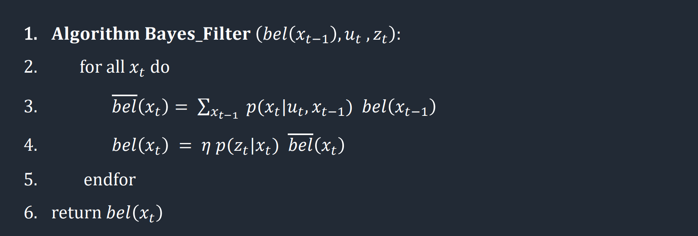

<section id="content">

<h2>Objective</h2>
The goal of this lab was to implement grid localization by constructing a Bayes Filter. For this lab, a simulator was provided to mimic the behavior of the robot, with the ability to rotate, translate and gather distance data as the simulated robot moves through a map. The Bayes Filter was built in a python Jupyter notebook for testing purposes, and will be transferred onto the robot in the next lab.

<h2>Pre-lab</h2>
Robot localization involves determining the location of the robot with respect to its environment. Some challenges that may occur during localization include inaccuracy in the robot's sensors and actuators. A Bayes Filter uses a robot's knowledge of its control inputs (movement in the case of our robot) which are subject to actuator noise, and combines it with the robot's observation data which can be sensitive to sensor noise in order to localize the robot. This is done in a two-step process: first the robot predicts its new location based on the control input while taking into account actuator noise. The prediction step represents where the robot think it will be based on where it used to be as well as its movement. Next, the robot corrects its predictions by rotating 360 degrees and incorporating measurement data. The update step represents where the robot actually is based on its sensor readings. The final result is an array of different positions and the probability that the robot is currently at that position, and these probabilities are constantly updated after every movement of the robot.

 

 The Bayes Filter calculates the belief that the robot exists in a potentially infinite number of positions. In order to make sure our Bayes Filter processes at a reasonable speed, we discretized the map into a (12, 9, 18) grid representing the x-coordinate, y-coordinate and angle. Our map is of the size:
<ul>
<li>(-1.6764, +1.9812) meters or (-5.5, 6.5) feet in the x direction </li>
<li>(-1.3716, +1.3716) meters or (-4.5, +4.5) feet in the y direction </li>
<li>(-180, +180) degrees along the theta axis </li>
</ul>
Each square in our grid is of size (0.3048 m, 0.3048 m, 20 degrees). This greatly reduces the number of positions that the Bayes Filter must consider and speeds up our running time significantly.

<h2>Implementation</h2>

The prediction step relies on control information from the robot, which we found using the odometry motion model. To find the robots rotation I used trigonometry based on the robots current and previous locations. I normalized the rotation angles in this step to keep all angles in the range of (-180, +180) degrees.

<pre><code>def compute_control(cur_pose, prev_pose):
    """ Given the current and previous odometry poses, this function extracts
    the control information based on the odometry motion model.

    Args:
        cur_pose  ([Pose]): Current Pose
        prev_pose ([Pose]): Previous Pose 

    Returns:
        [delta_rot_1]: Rotation 1  (degrees)
        [delta_trans]: Translation (meters)
        [delta_rot_2]: Rotation 2  (degrees)
    """
    #Finds the direction that the robot has moved based on previous and current position
    direction_rad = np.arctan2(cur_pose[1] - prev_pose[1], cur_pose[0] - prev_pose[0])
    direction_deg = math.degrees(direction_rad)
    
    #Rotation 1 and 2 are found by subtracting angles from the direction of motion
    delta_rot_1 = mapper.normalize_angle(direction_deg - prev_pose[2])
    delta_rot_2 = mapper.normalize_angle(cur_pose[2] - direction_deg)
    
    #Translation is found using pythagorean theorem
    delta_trans = np.sqrt((cur_pose[1] - prev_pose[1])**2 + (cur_pose[0] - prev_pose[0])**2)

    return delta_rot_1, delta_trans, delta_rot_2
</code></pre>

Next, we want to find the probability that the robot has reached some current position x' given previous position x and odometry values u. First, we find the actual control values (or the rotations and translation necessary to move from the previous to the current position) by passing the current and previous position parameters into our <i>compute_control</i> function. Then we use a gaussian distribution to find the probability that the robot moved to the current position based on the way we expected it to move given the motion commands the robot was told to follow out. The gaussian distribution is centered on the robots expected motion from the odometry model and a standard deviation parametrized by our trust in the odometry model. This function is equivalent to the probability to P(x' | x, u) or the probability that the robot has reached a current location x' given previous location x and movement commands u.

<pre><code>def odom_motion_model(cur_pose, prev_pose, u):
    """ Odometry Motion Model

    Args:
        cur_pose  ([Pose]): Current Pose
        prev_pose ([Pose]): Previous Pose
        (rot1, trans, rot2) (float, float, float): A tuple with control data in the format 
                                                   format (rot1, trans, rot2) with units (degrees, meters, degrees)

    Returns:
        prob [float]: Probability p(x'|x, u)
    """
    
    #Control data of the given positions, aka the actual rotations and translation needed to reach the current position
    actual_u = compute_control(cur_pose, prev_pose)
    
    #Uses a gaussian distribution to determine the probability that the current position was reached
    #Probability that the u (control data from odometry model) = actual_u (control data necessary to reach current position)
    prob_rot1 = loc.gaussian(u[0], actual_u[0], loc.odom_rot_sigma)
    prob_trans = loc.gaussian(u[1], actual_u[1], loc.odom_trans_sigma)
    prob_rot2 = loc.gaussian(u[2], actual_u[2], loc.odom_rot_sigma)
    
    #Final probability p(x_t | u_t, x_t-1)
    prob = prob_rot1 * prob_trans * prob_rot2

    return prob
</code></pre>

Finally, we have all values necessary to perform the prediction step of the Bayes Filter. To do so, we must loop through all 12 x 9 x 18 = 1944 current and possible hexes. To speed up our filter, we ignore all grid hexes that the robot is unlickly to be at, with a threshold of P(robot's previous location is at (x,y,a)) >= 0.0001.

<pre></code>def prediction_step(cur_odom, prev_odom):
    """ Prediction step of the Bayes Filter.
    Update the probabilities in loc.bel_bar based on loc.bel from the previous time step and the odometry motion model.

    Args:
        cur_odom  ([Pose]): Current Pose
        prev_odom ([Pose]): Previous Pose
    """
    
    #Expected movement of the robot based on odometry model
    u = compute_control(cur_odom, prev_odom)
    
    #Loop through all possible previous states
    for x1 in range(mapper.MAX_CELLS_X):
        for y1 in range(mapper.MAX_CELLS_Y):
            for a1 in range(mapper.MAX_CELLS_A):
                
                #Ignore grid hexes with negligible belief
                bel = loc.bel[x1][y1][a1]
                if bel >= 0.0001:
                    
                    #Loop through all possible current states
                    for x2 in range(mapper.MAX_CELLS_X):
                        for y2 in range(mapper.MAX_CELLS_Y):
                            for a2 in range(mapper.MAX_CELLS_A):
                                
                                #Prediction step
                                prob = odom_motion_model(mapper.from_map(x2, y2, a2), mapper.from_map(x1, y1, a1), u)
                                loc.bel_bar[x2][y2][a2] += (prob * bel)
</code></pre>

For the second half of the Bayes Filter, we want to update our predicted probability distribution using sensor measurements. First, we write the function <i>sensor_model()</i> to find the probability that the robot measures a given distance value based on the actual distance value it should measure from that current position and angle. This probability array contains 18 values corresponding to the 18 different values that the robot measures distance, at 20 degree increments spanning the range of (-180, 180) degrees.

<pre><code>def sensor_model(obs):
    """ This is the equivalent of p(z|x).

    Args:
        obs ([ndarray]): A 1D array consisting of the true observations for a specific robot pose in the map 

    Returns:
        [ndarray]: Returns a 1D array of size 18 (=loc.OBS_PER_CELL) with the likelihoods of each individual sensor measurement
    """
    
    #Initialize array so we can update probability is O(1) time
    prob_array = np.zeros(mapper.OBS_PER_CELL)
    
    for i in range(mapper.OBS_PER_CELL):
        #Probability that the robots true observation is correct for the current position
        prob_array[i] = loc.gaussian(loc.obs_range_data[i], obs[i], loc.sensor_sigma)

    return prob_array

</code></pre>

Next, we update the belief distribution of the robot. We loop through all possible positions and compare the known distance measurements from those positions to the actual sensor measurements of the robot at its current position. Then we perform the update step by multiplying this probability P(z|x) by the predicted belief <i>loc.bel_bar</i> found during the prediction step. Finally, we normalize the belief distribution to sum to 1.

<pre><code>def update_step():
    """ Update step of the Bayes Filter.
    Update the probabilities in loc.bel based on loc.bel_bar and the sensor model.
    """
    
    #Loop through all possible positions
    for x in range(mapper.MAX_CELLS_X):
        for y in range(mapper.MAX_CELLS_Y):
            for a in range(mapper.MAX_CELLS_A):

                #Update step based on robots sensor measurements
                prob_z = np.prod(sensor_model(mapper.get_views(x, y, a)))
                loc.bel[x][y][a] = prob_z * loc.bel_bar[x][y][a]
    
    #Normalize probabilities to sum to 1
    loc.bel = loc.bel / np.sum(loc.bel)
</code></pre>

<h2>Results</h2>
The results of the Bayes Filter were tested on the provided simulator. In the simulator plotter, red represents the odometry data, green represents ground truth and blue represents the belief of the robot. Across multiple trials, the ground truth and belief of the robot are fairly consistent and we can conclude that the Bayes Filter can accurately localize our robot. Note that the belief of the robot is clearly limited by the discretization of the map, and much more accurate position reading can be obtained by increasing our grid size, at the expense of processing power.

 

<iframe width="1263" height="480" src="https://www.youtube.com/embed/8cMPS5iOm44" title="ECE 4160 Lab 10: Demo" frameborder="0" allow="accelerometer; autoplay; clipboard-write; encrypted-media; gyroscope; picture-in-picture; web-share" allowfullscreen></iframe>