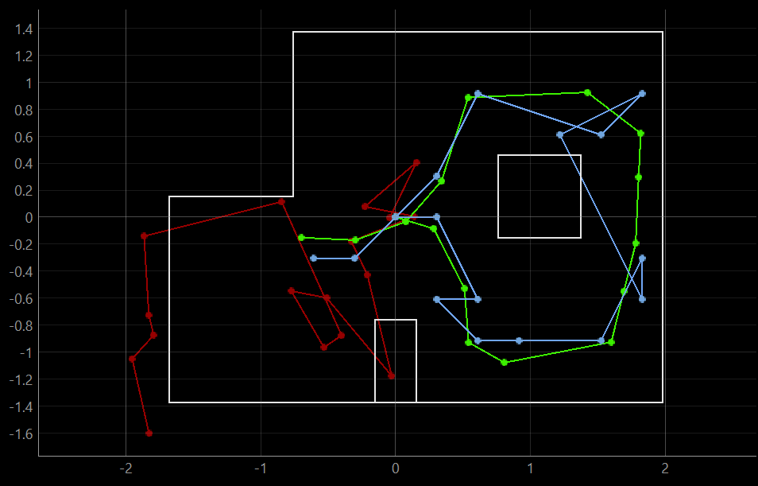

<section id="content">

<h2>Objective</h2>
Now that we have proven in the previous lab that our Bayes filter works in the simulation, we want to perform localization on our actual robot. For this lab, only the update step of the Bayes filter was implemented because the motion of the robot is too noisy and dependent on factors such as battery charge and friction between the wheels and the floor.

<h2>Bayes Filter (Sim)</h2>
A class provided, fully functional Bayes filter was provided and demonstrated on the simulator as a sanity check. The results of the Bayes filter are similar to the results found in my own Bayes filter that I constructed in lab 10. The image above shows odometry (red), ground truth (green), and the belief of the robot (blue), of which the latter of two match fairly well. Small differences in the two may come from the discretization of the map; since the Bayes filter limits the location of the robot to a 12 x 9 rectangular grid, the belief is limited to a number of evenly spaced out locations.

 

<h2>Bayes Filter (Real)</h2>
In order to perform localization on our robot, we created a <i>perform_observation_loop()</i> function as a part of the <i>RealRobot()</i> class. When this function is called, the robot will rotate a full rotation, and output a numpy array of ToF distance values and angular position values. The number of sensor readings depends on <i>observations_count</i> a variable defined in the <i>world.yaml</i> helper file. For this lab, <i>observations_count</i> = 18 and thus we take ToF distance measurements at equidistant 20 degree rotations.

To implement this function, I reused code from lab 9 where I programmed the robot to rotate and collect distance measurements as quickly as possible. I modified the arduino code to collect data at specific theta values, rather than as quickly as possible as in lab 9. I pass via bluetooth a desired number of observations to the robot, which then rotates one time and collects that same number of observations at equidistant angles.

<pre><code>//Output a number of distance measurements during one full rotation
case TASK:
    {
        Serial.println("Performing task...");

        //Interprets bluetooth command to determine number of observations
        int observations_count;
        success = robot_cmd.get_next_value(observations_count);
        if (!success) { return; }

        while (theta <= 360 && millis() <= stop_time) {
            getSensorData();
          
            //If current angle is at desired angle
            if (theta >= theta_read){
                //Send data and update desired angle
                send_data();
                theta_read = theta_read + 360/observations_count;
            }

            //Closed loop control to keep rotation speed constant
            pid();
            speed = min_speed - pid;
            if (speed > max_speed) speed = max_speed;
            right(speed);
        }
        stop();
        Serial.println("Task Complete");
        break;
    }
</code></pre>

According to my implementation, the measurements the robot takes might not occur at the exact angle desired. For example, when the robot is rotating at rapid speeds it may overshoot the 20 degree mark and instead take a ToF measurement at 22 degrees, introducing error to my localization system. However, based on my results from lab 9 my closed loop control was able to rotate the robot at a low enough speed that the ToF sensor could take measurements at less than 1 degree measurements. Therefore as long as the robot is rotated at a slow angular velocity, the angles that distance is sampled at should be within a reasonable difference from the desired sampling angles. One possible alternative method could be to rotate the robot exactly 20 degrees, stop to take a distance measurement, then begin rotating again a total of 18 times. I ultimately dismissed this idea because I lack faith in my robot's ability to start and stop accurately. I was also concerned that sudden changes in the robots gyroscope measurements would introduce inaccuracy in its angular position readings. Thus I chose the former method because I trust that the robot can rotate slowly enough to sample at least 18 times at intervals of 20 degrees.

<pre><code>#Angular data from one rotation
[0.15, 21.346, 40.585, 60.405, 82.206, 100.447, 120.193, 141.573, 161.768, 181.545, 200.276, 220.428, 240.16, 261.271, 280.832, 300.679, 320.957, 341.487, 361.44]
#Each measurement is within 1-2 degrees of the desired sampling angle
</code></pre>

My python code for the <i>perform_observation_loop()</i> function is shown below. For this function, I command the robot over bluetooth to rotate and collect distance measurements, with some preset speed parameters and PID gain values.. I then use a callback function to interpret the bluetooth values, and return the arrays after some numpy manipulation (unit conversions, swapping from a horizontal to a vertical array). I also had to use the <i>asyncio.sleep()</i> function so that the script will wait for the robot to finish its spin before proceeding.

<pre><code>class RealRobot():
    async def perform_observation_loop(self, rot_vel):
        """Perform the observation loop behavior on the real robot, where the robot does  
        a 360 degree turn in place while collecting equidistant (in the angular space) sensor
        readings, with the first sensor reading taken at the robot's current heading. 
        The number of sensor readings depends on "observations_count"(=18) defined in world.yaml.
        
        Keyword arguments:
            rot_vel -- (Optional) Angular Velocity for loop (degrees/second)
                        Do not remove this parameter from the function definition, even if you don't use it.
        Returns:
            sensor_ranges   -- A column numpy array of the range values (meters)
            sensor_bearings -- A column numpy array of the bearings at which the sensor readings were taken (degrees)
                               The bearing values are not used in the Localization module, so you may return a empty numpy array
        """
        time_list = []
        theta_list = []
        distance_list = []
        
        def callback(uuid, string_value):
            string_characteristic = self.ble.bytearray_to_string(string_value)
            str_list = list(map(float, re.findall('-?\d+\.?\d*', string_characteristic)))
            time_list.append(str_list[0])
            theta_list.append(str_list[1])
            distance_list.append(str_list[2])
        
        observations_count = int(self.config_params["mapper"]["observations_count"])
        
        self.ble.send_command(CMD.SET_SPEED, "90|1|90")
        self.ble.send_command(CMD.SET_PID, "1|0|0.1")
        self.ble.send_command(CMD.SET_POINT, str(rot_vel))

        self.ble.start_notify(ble.uuid['RX_STRING'], callback)
        self.ble.send_command(CMD.TASK, str(observations_count))
        await asyncio.sleep(120/rot_vel)
        ble.stop_notify(ble.uuid['RX_STRING'])
        
        sensor_ranges = np.divide(np.array(distance_list), 1000)[np.newaxis].T
        sensor_bearings = np.array(theta_list)[np.newaxis].T

        return sensor_ranges, sensor_bearings
</pre></code>

<h2>Results</h2>

<h3>(-3, -2)<h3>
 
 

<h3>(0, 3)<h3>
 
 

<h3>(5, 3)<h3>
 
 

<h3>(5, -2)<h3>
 
 

The robot has a very high confidenc in its update position; from the images above we can observe that the probability the robot is in its current location is nearly 1 for all four locations. The predicted locations from the update step match the actual ground truth of the robot fairly well. However, although the robot accurately localizes its X and Y coordinates, the robot seems to think it is at a -10/-30 degree offset in all four update steps. From talking to the TAs it seems like this issue occurs in the <i>localization.py</i> module in the way that the grid is discretized. The angle space is discretized into 20 degree increments, but the robot is always at the center of these increments; instead of being at 0 degrees, the robot is either at -10 or 10 degrees. I plan to correct this issue in future labs.
