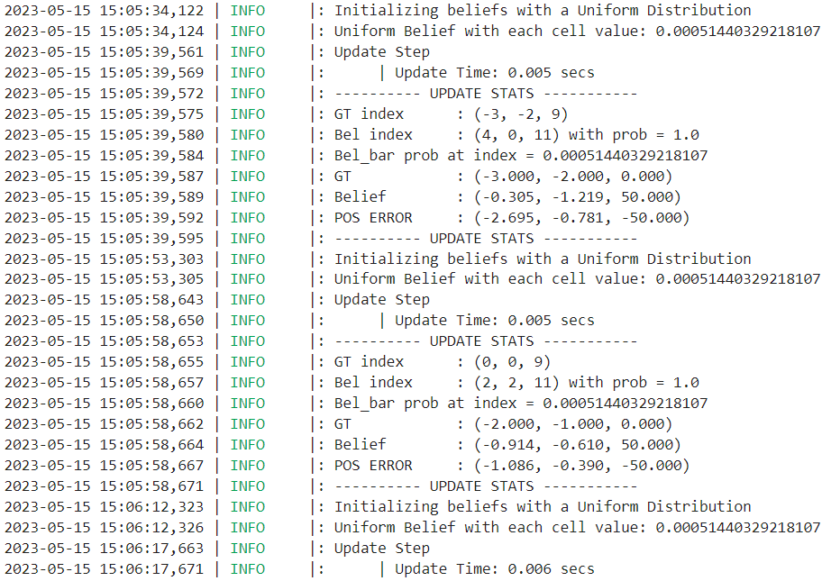

<section id="content">

<h2>Objective</h2>

The culmination of many, many hours of labor, the final lab 12 involves navigating our robot through a maze. The goal of the lab is to reach every single waypoint in a set of nine waypoints via any means necessary.

 
 

<h2>Initial Design: Onboard</h2>

The car must perform three different actions as it navigates the maze. First and foremost, the car must drive forward and for the purposes of this lab I designed an arduino function to stop the car after reaching a set distance. To do so, I first derived a setpoint by subtracting the desired travel distance from the current frontal ToF sensor reading. When the new ToF sensor reading is exactly (x) less than the initial ToF sensor reading, that means that the car has moved (x) distance forward. After finding the setpoint, the car behaves as in lab 7, using a PID controller to reach the set point and a Kalman Filter to bypass the slow sensor readings. Below shows the pseudocode of my command.

<pre><code>// Drives the robot forward a set distance
case FORWARD_PID:
    {
        // Get desired translation over bluetooth

        // Find current ToF sensor distance reading

        // Setpoint = current distance - desired translation

        // Initialize Kalman Filter

        // while (time < stop_time)
            // Get sensor data

            // Kalman Filter

            // PID

            // Drive forward

        // Send debugging data over bluetooth
    }
</code></pre>

Secondly, the car must be able to turn. Similarly to the driving forward command, I built my function to turn the car a specific theta value based off of code from lab 9. This function uses PID control to turn the car at a constant angular velocity. The car keeps track of its angular position by integrating over the angular velocity found from the gyroscope, and stops once the theta has been reached. I also use an if statement so that a postive theta input will spin the car to the right, and a negative theta input will cause the car to turn to the right.

<pre><code>// Turns the robot a set theta
case TURN:
    {
        // Receive desired theta value over bluetooth

        // If desired theta is positive, turn left
            // While (theta < desired theta)
                // Get sensor values

                // PID

                // Turn left
        
        // If desired theta is negative, turn right
            // While (theta > desired theta)
                // Get sensor values

                // PID

                // Turn left
    }
</code></pre>

The final functionality of the car is a localization function. This function is identical to the localization command I created in lab 11, where the car will spin as slowly as possible in a 360 degree circle. As it spins, the car will sent over bluetooth a number of distance measurements that are evenly spaced by theta value.

<pre><code>//Performs observation loop, equally spaced between one 360 degree rotation
case LOCALIZE:
    {
        //Recieve over bluetooth number of observations

        //While (theta < 360)
            //Get sensor values
          
            //If theta is an interval of 360/number of observations
                //Send observation data over bluetooth

            //PID

            //Turn left
    }
</code></pre>

<h2>Initial Design: Offboard</h2>

Offboard, I used a jupyter notebook to send commands to the robot and interpret received data. Similar to in lab 11, I built a robot class that can command the robot over bluetooth to perform the localization function. I also created python functions to command the robot to drive forward and turn, as well as callback functions to interpret sensor data received over bluetooth.

<pre><code>#Definition of robot class
class RealRobot():
        
    #A class to interact with the real robot, based off code from lab 11
    def __init__(self, commander, ble)

    async def perform_observation_loop(self):
        #Callback function    
        def callback(uuid, string_value):
            string_characteristic = self.ble.bytearray_to_string(string_value)
            str_list = list(map(float, re.findall('-?\d+\.?\d*', string_characteristic)))
            time_list.append(str_list[0])
            theta_list.append(str_list[1])
            distance_list.append(str_list[2])
        
        observations_count = int(self.config_params["mapper"]["observations_count"])

        self.ble.start_notify(ble.uuid['RX_STRING'], callback)
        self.ble.send_command(CMD.LOCALIZE, str(observations_count))
        await asyncio.sleep(5)
        ble.stop_notify(ble.uuid['RX_STRING'])
        
        sensor_ranges = np.divide(np.array(distance_list), 1000)[np.newaxis].T
        sensor_bearings = np.array(theta_list)[np.newaxis].T

        return sensor_ranges, sensor_bearings
    
    #Drives the robot forward for a set amount of time
    async def forward_timed(self, time):
        self.ble.send_command(CMD.FORWARD, str(time))
        await asyncio.sleep(time+1)
        return
    
    #Drives the robot forward by some translation
    async def forward(self, translation):
        #Callback function
        def callback(uuid, string_value):
            global string_characteristic
            string_characteristic = ble.bytearray_to_string(string_value)
            str_list = list(map(float, re.findall('-?\d+\.?\d*', string_characteristic)))
            time_list.append(str_list[0])
            sensor_time_list.append(str_list[1])
            distance_list.append(str_list[2])
            estimated_distance_list.append(str_list[3])
            error_list.append(str_list[4])
            pid_list.append(str_list[5])
            speed_list.append(str_list[6])

        self.ble.start_notify(ble.uuid['RX_STRING'], callback)
        self.ble.send_command(CMD.FORWARD_PID, str(translation))
        await asyncio.sleep(10)
        ble.stop_notify(ble.uuid['RX_STRING'])
        return

    #Turns the robot by some theta
    async def turn(self, rotation):
        self.ble.send_command(CMD.TURN, str(rotation))
        await asyncio.sleep(3)
        return
</code></pre>

For the actual control of the robot, I used a mixed open/closed control loop to drive the robot through the maze. I stored the waypoints into an array, and used functions created in lab 10 to output the necessary trajectories required to travel between two waypoints. By inputting two waypoints into the <i>compute_control()</i> function, I can find the rotation and translation required to reach point B from point A. I then use these rotation and translation values with the previously described arduino commands to move the robot to point B from point A. 

After moving, I command the robot to perform the update step of the Bayes' filter to find its current location within the maze. The current location is then used as point A as the robot attempts to travel to the next waypoint, or point B. Since my Bayes' filter update step from lab 11 does not accurately record current angle, I chose to record the angle manually after every rotation. This hack relies on the assumption that the robot actually rotates the amount I tell it to rotate, but I found this assumption to be fairly accurate.

<pre><code>#Function definitions
def feet_to_mm(feet):
    return (int) (feet * 0.3048 * 1000)

#From lab 10
def compute_control(cur_pose, prev_pose):
    #Finds the direction that the robot has moved based on previous and current position
    direction_rad = np.arctan2(cur_pose[1] - prev_pose[1], cur_pose[0] - prev_pose[0])
    direction_deg = math.degrees(direction_rad)
    
    #Rotation 1 is found by subtracting angles from the direction of motion
    delta_rot_1 = mapper.normalize_angle(direction_deg - prev_pose[2])
    
    #Translation is found using pythagorean theorem
    delta_trans = feet_to_mm(np.sqrt((cur_pose[1] - prev_pose[1])**2 + (cur_pose[0] - prev_pose[0])**2))

    return delta_rot_1, delta_trans
</code></pre>

<pre><code>#Control loop
waypoints = [[-3,-2,0], [-2,-1,0], [1, -1,0], [2, -3,0], [5, -3,0], [5, -2,0], [5, 3,0], [0, 3,0], [0,0,0]]

#Initialize Bayes Filter, runs update step once
cmdr.reset_plotter()
loc.init_grid_beliefs()
await loc.get_observation_data()
loc.update_step()
loc.print_update_stats(waypoints[0], plot_data=True)

for i in range(len(waypoints) - 1):
    #Robot motion commands
    rot1, trans = compute_control(waypoints[i+1], waypoints[i])
    await robot.turn(rot1)
    await robot.forward(trans)
    
    #Bayes Filter update step
    loc.init_grid_beliefs()
    await loc.get_observation_data(20)
    loc.update_step()
    loc.print_update_stats(waypoints[i+1], plot_data=True)

    #Updates waypoints array
    current_position = loc.get_belief()
    waypoints[i+1][0] = current_position[0]
    waypoints[i+1][1] = current_position[1]
    #Since my update step does not accurately output current rotation, I chose to record the angle manually
    waypoints[i+1][2] = waypoints[i][2] + rot1
</code></pre>

<h2>Challenges</h2>

<h4>ToF Sensor Struggles<h4>

One of the first issues I discovered involved the robot's driving forward function. More specifically, I found that the robot's PID control loop would over accelerate the robot causing an overshoot of the waypoint. Upon inspecting the distance sensor outputs, I found that the ToF sensors would behave very noisily at large distances, creating an increase in the positional error and causing the car to mistakenly accelerate. One possible explanation is that the slight tilt of the robot combined with the long distances causes the time of flight of the ToF sensor to increase. Alternatively, the entirety of the maze may simply be outside of the sensors operable range, especially when considering diagonal measurements across the maze.

 

This was a major issue for the first waypoint transition, (-4, -3) -> (-2, -1), because the robot starts at the bottom left corner and faces the top right corner, resulting in a hypotenuse that is greater than four meters, or the maximum range of the ToF sensors. To fix this issue, I created a new arduino function that drives the car forward for a set period of time. I then experimentally determined how long the car needed to drive forward to travel from the first to the second waypoint.

<pre><code>#For the first waypoint transition, I tell the robot to drive based on time rather than distance
await robot.turn(45)
await robot.forward_timed(1.8)
await robot.turn(-45)
</code></pre>

<h4>Localization<h4>

Originally, I had planned to have the robot localize after reaching every waypoint so that the robot could correct itself upon missing a target. Without localization, small mechanical errors in the robots movement build up over time because the robot is performing under the assumption that it reaches every target perfectly. There were two issues with my plan; firstly, my robot does not spin in a perfect circle upon performing the observation loop. Instead, the robot spins about with a slight radius that varies from attempt to attempt and offsets the robot slightly with every localization attempt. Ideally, this issue would be negligible because the robot can find its location and adapt accordingly despite the slight movement. However, I also found that although my Bayes' filter update step is accurate at the waypoints, the accuracy plummets when the robot is near a wall. Thus including localization in my control loop actually reduced my robots' ability to navigate through the maze.

Below shows a run using localization after reaching every waypoint. From the video you can see how the robot's observation loop causes it to shift slightly because it does not spin in a perfect circle. I also included a plot of the simulator representing the robot's belief in its current location, as well as the python log outputs. The robot does attempt to localize and correct its path, but unfortunately it is too unreliable to perform precise movements through the maze.

<iframe width="1263" height="480" src="https://www.youtube.com/embed/eDvHMEbneFg" title="ECE 4160 Lab 12: Localization Attempt" frameborder="0" allow="accelerometer; autoplay; clipboard-write; encrypted-media; gyroscope; picture-in-picture; web-share" allowfullscreen></iframe>

 
 
 

<h2>Results</h2>

Here are some semi-successful attempts:

<iframe width="1263" height="480" src="https://www.youtube.com/embed/qEsaqd4YX5c" title="ECE 4160 Lab: Trial 1" frameborder="0" allow="accelerometer; autoplay; clipboard-write; encrypted-media; gyroscope; picture-in-picture; web-share" allowfullscreen></iframe>

<iframe width="1263" height="480" src="https://www.youtube.com/embed/rBqOi8M1Uuw" title="ECE 4160 Lab 12: Trial 2" frameborder="0" allow="accelerometer; autoplay; clipboard-write; encrypted-media; gyroscope; picture-in-picture; web-share" allowfullscreen></iframe>

<iframe width="1263" height="480" src="https://www.youtube.com/embed/Bsdc-MMP5jM" title="ECE 4160 Lab 12: Trial 3" frameborder="0" allow="accelerometer; autoplay; clipboard-write; encrypted-media; gyroscope; picture-in-picture; web-share" allowfullscreen></iframe>

A common theme among these first three trials is that the robot misses the second to last waypoint. The transition from the 7th to 8th waypoints, or (5, 3) -> (0, 3), is one of the largest distances the robot has to travel. At this distance and speed, the differences between the left and right wheels causes the robot to tilt slightly to the left, and the robot ends up failing to hit the (0, 3) waypoint. I attempted to fix this by applying a reduction to the speed of the right wheels, but ran into issues because the robot moves at a variety of different speeds throughout the maze. I could have had a dynamically changing factor reduction of the right wheels, but I wanted to avoid such a hacky adjustment.

For the next trial the robot had some interesting behavior at the very end:

<iframe width="1263" height="480" src="https://www.youtube.com/embed/OES5VJarEho" title="ECE 4160 Lab 12: Trial 4" frameborder="0" allow="accelerometer; autoplay; clipboard-write; encrypted-media; gyroscope; picture-in-picture; web-share" allowfullscreen></iframe>

Here was my best attempt, where bumping in the wall actually helped my robot get back on course:

<iframe width="1263" height="480" src="https://www.youtube.com/embed/GOpEUAk4-Ik" title="ECE 4160 Lab 12: Trial 5" frameborder="0" allow="accelerometer; autoplay; clipboard-write; encrypted-media; gyroscope; picture-in-picture; web-share" allowfullscreen></iframe>

Overall I'm fairly satisfied with how my robot was able to navigate through the maze. I do wish I had more time to refine the localization and implement the full Bayes filter into my control loop, but due to time constraints I settled for a much simpler control scheme. I found this lab quite challenging and time-consuming, but ultimately enjoyed my time tackling the task as I consolidated all the work I've put into previous labs throughout this semester. Thanks to all the course staff for making this class such a great experience!
