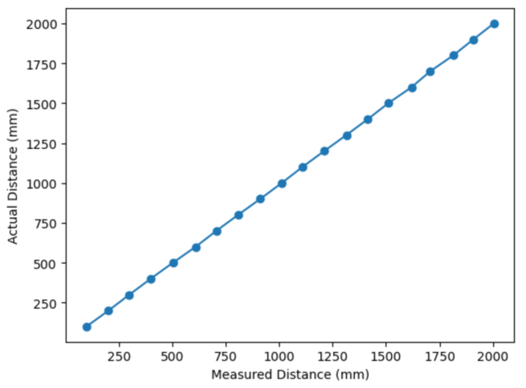

<section id="content">

<h2>Objective</h2>

The goal of this lab was to connect the Artemis board to two VL53L1X Time-of-Flight Distance Sensors. This involved soldering wires to the ToF (Touch-of-Flight) sensors and connecting the sensors to the Artemis board by headers and a QWIIC breakout board. Distance sensors will allow our robot to detect and react to obstacles in future tasks.

<h2>Prelab</h2>

The <a href="https://cdn.sparkfun.com/assets/e/1/8/4/e/VL53L1X_API.pdf">user manual</a> and <a href="https://cdn.sparkfun.com/assets/8/9/9/a/6/VL53L0X_DS.pdf">datasheet</a> of the VL53L1X were studied prior to the lab. There are a few decisions to decide upon regarding the ToF sensors:
<ul>
    <li>The final robot will use two ToF sensors, but since the address of the sensor is hardwired on the Artemis board, the two sensors can not be addressed individually without some changes. Possible solutions include changing the address by programming or enabling the sensors seperately by their shutdown pins. I chose to solve the issue by changing the address of the second ToF sensor so that the sensors could be used in parallel without being turned on and off. This method required soldering an extra connection from the shutdown pin of the ToF sensor to the I/O outputs of the Artemis board so that the addresses could be changed during setup. </li>
    <li>The placement of the ToF sensor can change the robots effective field of vision. Since the robot tends to move forward, at least one ToF sensor should be at the front of the robot. However, the second ToF sensor can placed be on the side of the robot, which would allow a large field of vision on one side of the robot but not the other side. You can even put a sensor on the back of the robot, which would improve vision of the robot after it flips 180 degrees. Another possible arrangement is placing both sensors on the front of the robot, one of the left and one on the right. This would allow a wild frontal field of vision as well as more accurate distance readings where the sensors overlap. </li>
    <li>In order to keep the placement of the sensors flexible, long wires were soldered to the ToF sensors so their arrangement could be swapped around when the robot is built. The wires attached to the ToF sensor can be permanently soldered. However, the connection between the ToF sensors and the Artemis board is kept detachable using a breakout board  so that the sensors to be attached and reattached as desired, in case bugfixing or rearrangement is needed. The wires were soldered on the side of the board opposite of the actual sensor because the sensors will face outwards while the wires should be kept inside the robot chassis. </li>
</ul>

<h2>Connecting the Sensors</h2>

The first task was to solder a connection between the two ToF sensors and the Artemis board. The red wire was soldered to Vin and the black wire was soldered to GND by convention. The next task was to determine which of the wires, blue or yellow, represented data signals SDA and SCL respectively. This was done by opening the Artemis board data sheet and comparing the <a href = https://cdn.sparkfun.com/assets/5/5/1/6/3/RedBoard-Artemis-Nano.pdfschematic>schematic</a> to the header connection. The blue wire was soldered to SDA and the yellow wire was soldered to SCL on both of the ToF sensor boards.

<h2>I2C Addressing</h2>

Next, the SparkFun VL53L1X 4m laser distance sensor library was installed via the Arduino IDE. The Apollo 3 -> Example05_Wire_I2C.ino was used as an example to learn the I2C library. The address of one ToF sensor was found to be 0x29. When both ToF sensors are connected, addresses 0x1, 0x2, 0x3 ... 0x7E were all detected.

<h2>Sensor Data</h2>

The ToF sensor has three functions avaialable:
<pre>
<code>.setDistanceModeShort(); //1.3m 
.setDistanceModeMedium(); //3m 
.setDistanceModeLong(); //4m, Default
</code>
</pre>
These functions optimize the ranging performance given the expected distance of operation. Depending on the task, different distance modes can be set on the final robot in order to maximize accuracy. For example, a task that involves avoiding many nearby obstacles would rely on the short distance mode, while a task that involves looking for a distant object could utilize the long distance mode. For the purposes of this lab, the <b>.setDistanceModeShort()</b> method was used.

In order to test the measurements of the ToF sensor, the below experiment was set up.

Repeated measurements from the ToF sensor were gathered from various distances. A white wall and good lighting were used to ensure the sensor could accurately detect the distance from the wall. For the experiment, 100 measurements were gathered at 100 mm intervals.

The sensor is overall very precise in its measurements. Another important characteristic of the sensor to determine is its reliability, or how often it will output the same measurement at the same distance. The results are shown below: 

The measurements of the sensor do tend to vary, but only on the magnitude of a few millimeters. The inaccuracy of the meassurements increase past the 1.3 m mark, which matches the specification of the distance mode function used, <b>.setDistanceModeShort()</b>. The effective range of the sensor was found max out at a distance of 2.3 m.

<h2>Parallel Sensors</h2>

Both ToF sensors were connected to the Artemis board simultaneously. The address of the sensor is hardwired on the board, so having multiple sensors is not easily supported. To solve this, an additional wire were soldered from the shutdown pin of one ToF sensor to the output pin GPIO_08 of the Artemis board. A signal is sent from the I/O of the Artemis board to the shutdown pin when the Artemis board is first initialized. While the ToF sensor is shutdown, the second ToF sensor's address is changed in Arduino code. The shutdown signal is set to low, re-enabling the ToF sensor and allowing both sensors to work in parallel with seperate memory addresses.

<h2>Sensor Speed</h2>

The speed of the ToF is significantly slower than the clock cycle of the Artemis board. This was determined through the below code, which prints the clock timing and sensor data as often as they are individually available. The frequency of time prints is much greater than the frequency of sensor measurement prints, so the limiting time factor is the time it takes for the ToF sensor to gather data rather than the microcontroller's internal clock cycle. The code below showcases the code used to test the timing of the internal clock and the below video shows the frequency the time can be retrieved compared to the much slower distance measurements.

<pre><code>#Code used to test sensor speed
while (!distanceSensor1.checkForDataReady() && !distanceSensor2.checkForDataReady())
{
    int time = millis();
    Serial.println("Time: ");
    Serial.print(time);
    Serial.println();
    delay(1);
}
</code></pre>
<iframe 
    width="560" 
    height="315" 
    src="https://www.youtube.com/embed/FNt41tdkW2U" 
    title="YouTube video player" 
    frameborder="0" 
    allow="accelerometer; autoplay; clipboard-write; encrypted-media; gyroscope; picture-in-picture; web-share" 
    allowfullscreen>
</iframe>

<h2>Bluetooth</h2>

Using methods created in Lab 2, the distance from both sensors was sent to my computer via bluetooth. This data can be compiled into a graphical form for easier data analysis. The below graph shows distance data gathered over approximately 5 seconds from both sensors. The first ToF sensor was kept steady, while the second ToF sensor was slowly moved to face a more distant wall.

