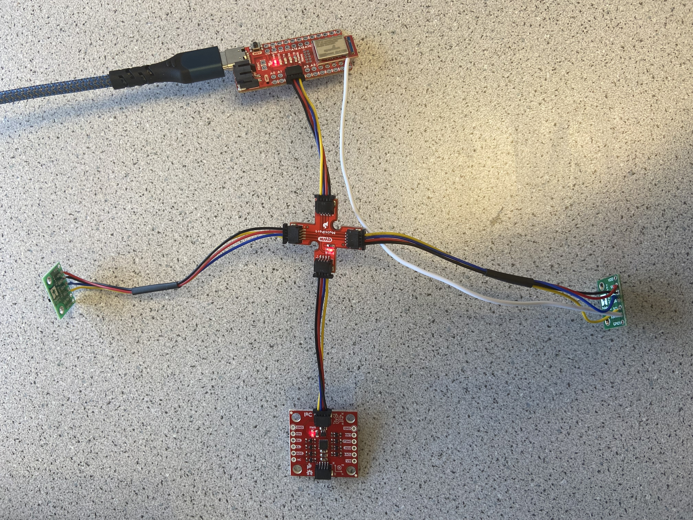
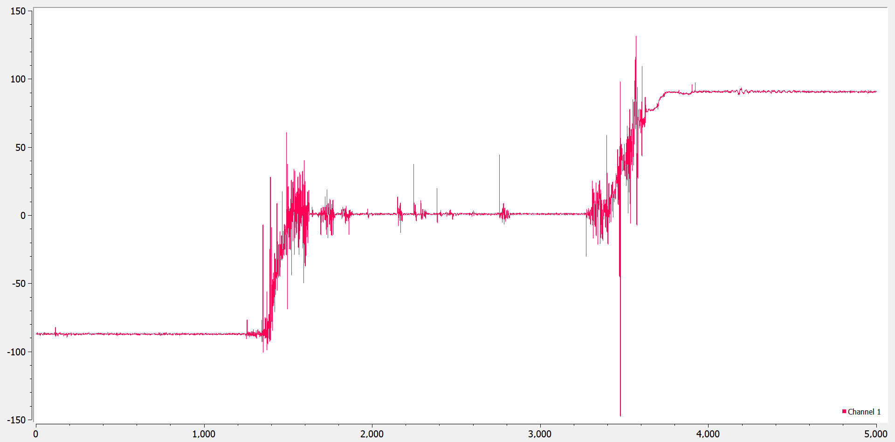
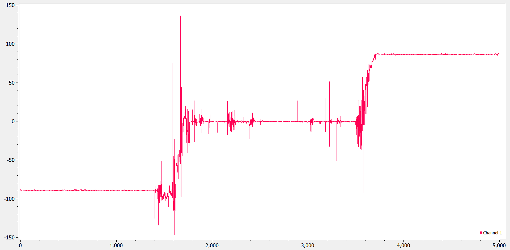
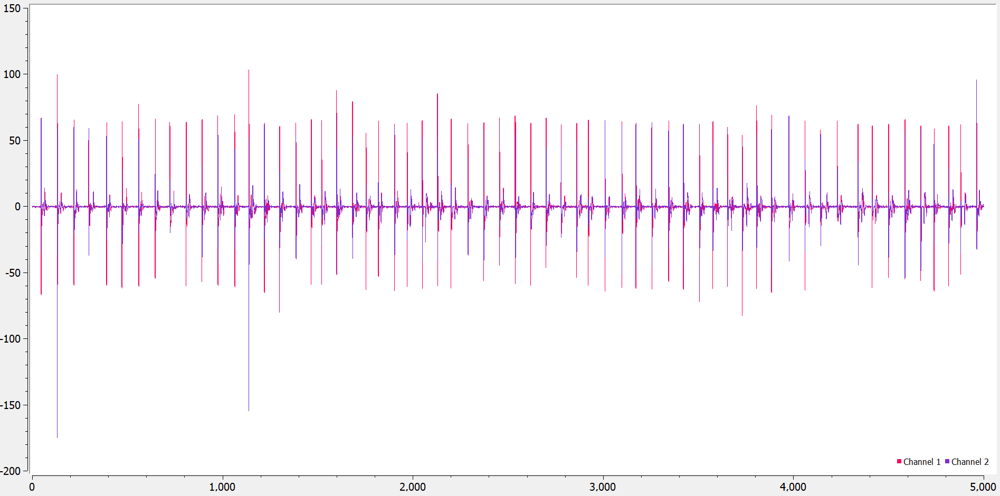
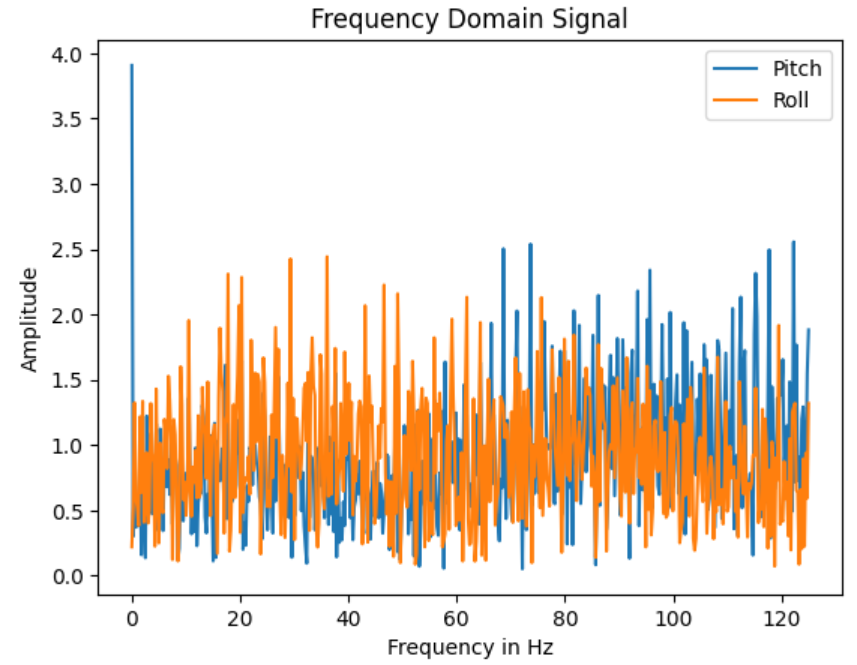
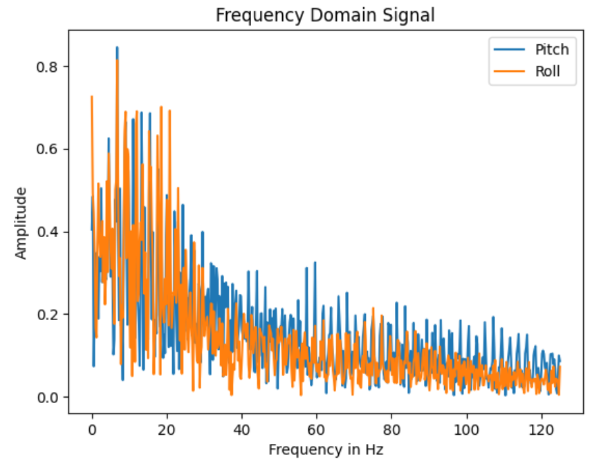
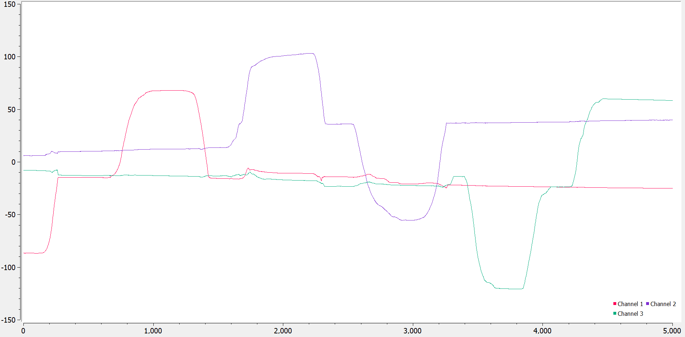
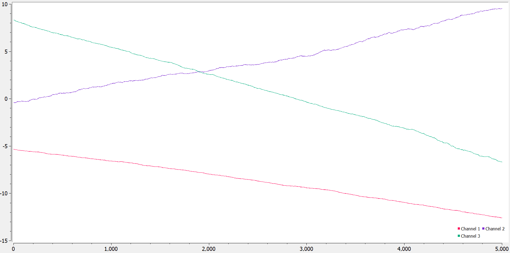
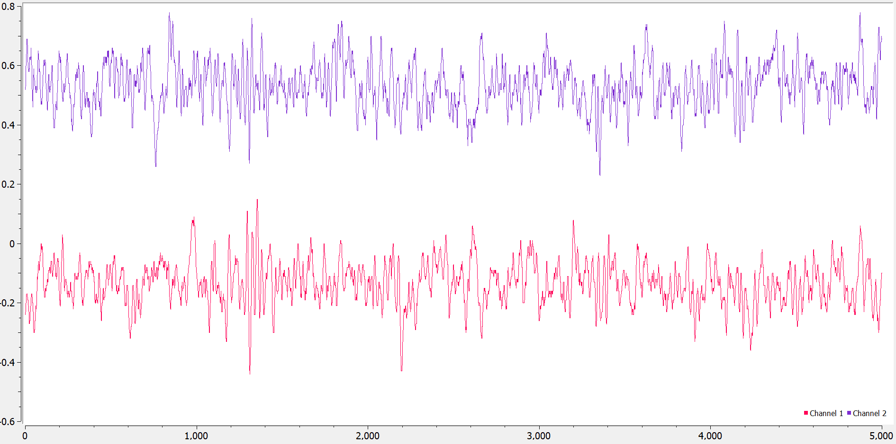
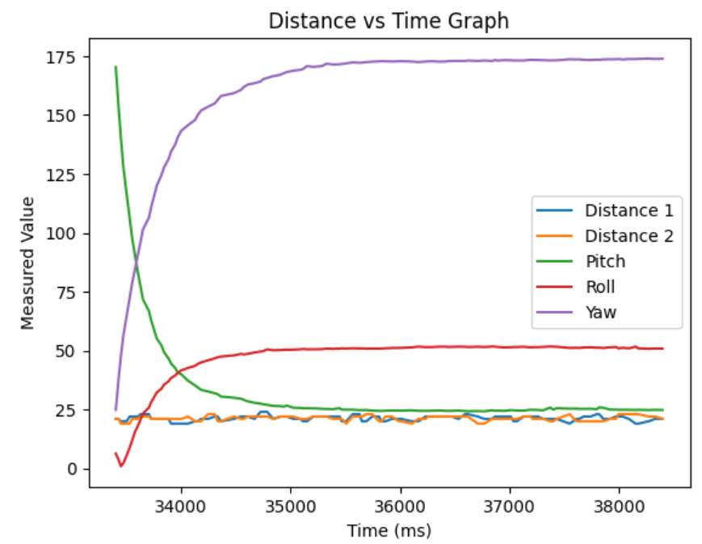

<section id="content">

<h2>Objective</h2>

 The goal of this lab was to integrate the Inertial Measurement Unit, or IMU, into the Artemis board, and develop functionality to send positional data to a computer through the IMU accelerometer, gyroscope and magnetometer. The IMU completes the sensor system of the robot, which can be attached to the car to gather distance and location data.

<h2>Set up the IMU</h2>

 The code <code> #define AD0_VAL 1 </code> defines the pinout of the IMU on the Artemis board. The Artemis board has pins dedicated to I/O, one of which is chosen to be the connection controlling the IMU. Setting <b>AD0_VAL</b> as 1 pulls the pin high, designating the corresponding pin as an output. Initial testing of the data using sample code shows that the measurements are very noisy, and that the gyroscope data only measures based on motion of the board.

<h2>Accelerometer</h2>

 The accelerometer on board the IMU is used to measured the linear acceleration, which can be used to find the pitch and roll of the robot. <code> pitch = atan2(myICM.accX(),myICM.accZ())*180/M_PI </code> was used to find the pitch of the robot from its acceleration in the X and Z axes, since pitch is found by rotating around the Y axis. Similary, roll was found by using acceleration in the Y and Z axes since roll is found as the rotation around the X axis. As seen in the above pictures, which show the pitch and roll of the board at {-90, 0, 90} degrees respectively, the data is accurate but slightly noisy. The accuracy can be improved by calibrating the values to their expected value; for example, adding code to change a 1 degree reading to 0 degrees when the board is lying flat on the table, or changing an 89 degree pitch reading to 90 degrees when the board is upright.

 In order to reduce noise, a low pass filter was added to the accelerometer measurements. An expriment was performed by tapping the IMU at regular intervals to produce a low frequency mechanical noise, and gathering the resulting accelerometer data. The below images show the fourier fast transform of the accelerometer data before and after the low pass filter was implemented. After the low pass filter, the amplitude of noise at low frequency decreased significantly.

<h2>Gyroscope</h2>

 Next, the gyroscope on board the IMU was used to determine pitch, roll and yaw. The gyroscope measures angular acceleration and thus pitch can be derived from the code <code>pitch_g = pitch_g + myICM.gyrX()*dt</code>. Pictured above is the pitch, roll and yaw measurements at {-90, 0, 90} degrees labeled as channel 1, 2 and 3 respectively. Compared to the accelerometer readings, these values are much less noisy.

 One drawback of the gyroscope is its tendency to drift overtime, resulting from the method of its calculation. The above image shows the readings of the gryoscope over a period of time without motion, where the gyroscope readings change dramatically despite no real movement. This issue was fixed by combining readings from both the gyroscope and accelerometer. The final result is a reading slightly noisier than the gyroscope but with no noticable drift, pictured below.

<iframe 
    width="560" 
    height="315" 
    src="https://www.youtube.com/embed/_qDvX8RgleI" 
    title="YouTube video player" 
    frameborder="0" 
    allow="accelerometer; autoplay; clipboard-write; encrypted-media; gyroscope; picture-in-picture; web-share" 
    allowfullscreen>
</iframe>

<h2>Sample Data</h2>

 When all delays are removed from the code except for serial prints to read the pitch, roll, yaw and time, the data gathering loop runs every 6 milliseconds. A significant speed up was done by only gathering data when the IMU has data available. The output data of the IMU was then outputed through bluetooth into the computer, where it can be more easily accessed in arrays. Below is the output of a python script that gathers five seconds of sensor data from the IMU and ToF sensors over bluetooth and then plots it for easier analysis. One possible bug that needs fixing is that the IMU sensors seem to wildly overshoot its measurements when the bluetooth command is first called, and slowly taper down to a more accurate reading.

<h2>Cut the Coord</h2>

 Next, batteries were added to the Artemis board so it could be mounted onto the car without needing power from a laptop USB-C connection. A higher current capacity, 3.7V 850mA battery was used to power to motors due to the high current draw from the mechanical motors, while a 3.7V 650mA battery was used to power the less demanding Artemis board peripherals. The battery was soldered to a connector and then attached to the Artemis board, which was then taped onto the car.

<h2>Record a Stunt</h2>
<iframe 
    width="560" 
    height="315" 
    src="https://www.youtube.com/embed/QbDHp2bLXGw" 
    title="YouTube video player" 
    frameborder="0" 
    allow="accelerometer; autoplay; clipboard-write; encrypted-media; gyroscope; picture-in-picture; web-share" 
    allowfullscreen>
</iframe>

 The above video shows the car in action with the Artemis board and attached sensors on top. Data was gathered from the above stunt that corresponds to the movements of the car itself, shown in the figures below. When the car was spun around, the corresponding IMU measurements show an oscillating yaw measurement. Similarly, the ToF sensors placed on the front and back of the car vary rapidly as the car spins, and have readings of zero every time the car faces a wall too far to properly guage distance.

