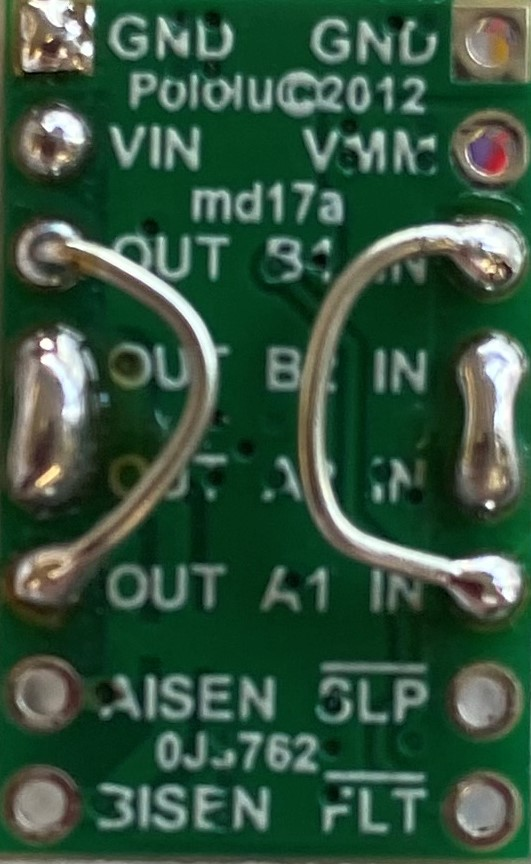
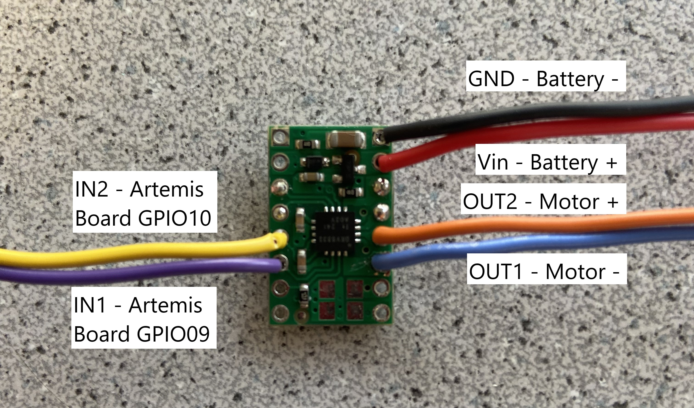
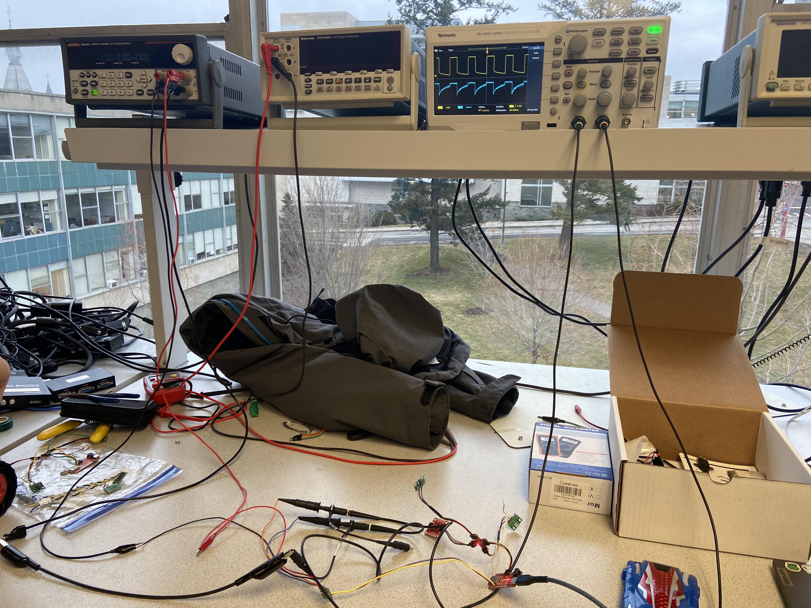
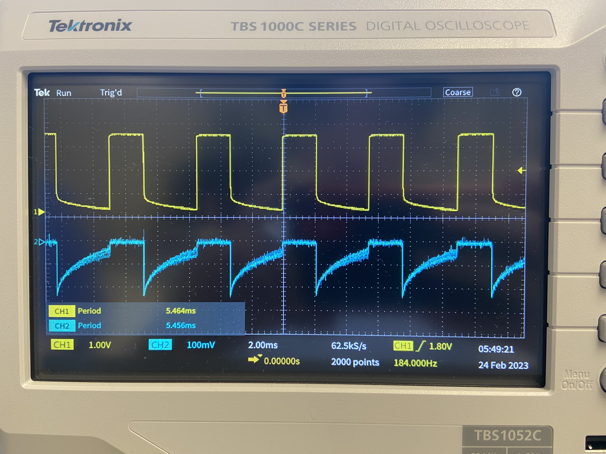
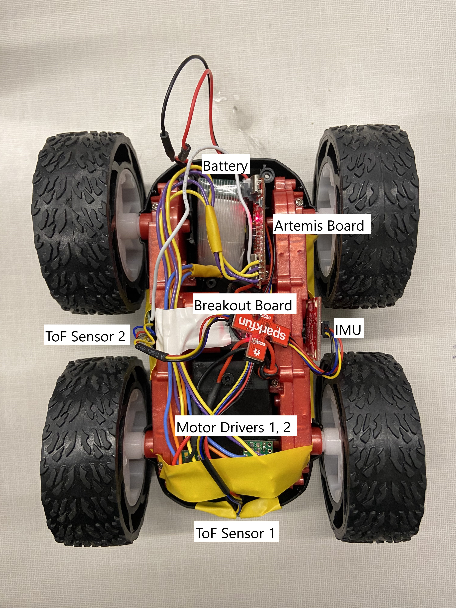

<section id="content">

<h2>Objective</h2>

 The goal of this lab was to integrate two dual motor drivers (<a href="https://www.pololu.com/product-info-merged/2130">documentation</a>, <a href="https://www.ti.com/lit/ds/symlink/drv8833.pdf?HQS=dis-dk-null-digikeymode-dsf-pf-null-wwe&ts=1677689102510&ref_url=https%253A%252F%252Fcei-lab.github.io%252F">datasheet) to control the two motors of the Force1 RC Car. These motor drivers can be controlled directly by the Artemis board output pins to drive the car in an open loop system.

<h2>Prelab</h2>

 Although each motor driver has the pinouts to control two motor drivers each, the inputs and outputs of the driver boards were shorted together. This allows the usage of two channels to drive each motor, doubling the amount of current we can supply to the motor. The I/O pins of the Artemis board that were utilized were pins 9, 10, 11, and 12. These pins were chosen for physical reasons; the connection to the IMU was previously chosen to be pin 8, which is on the opposite side of the Artemis board as the pins chosen for the motor drivers. This makes it easier to seperate the high noise mechanical motors and drivers with the more sensitive sensors of the IMU. Another design consideration is the batteries to be used to power the Artemis board and motors. The motors are powered with a higher current, 850 mAh battery due to its large current draw while the less demanding Artemis board and sensors are powered by a 650 mAh battery. Decoupling the power supplies also allows the Artemis board to function independently of the motors; if the motors drain all the power from the battery, this will not shut down the entire Artemis board system. 

Pictured above is the shorted connections on the motor driver board, as well as the connections to the rest of the system. The Vin of the board is connected to the positive lead of the battery while the GND pin is connected to the negative lead of the battery. The two outputs of the driver board are connected to the positive and negative leads of the motor, and the two inputs are connected to I/O pins on the Artemis board (GPIO9 and GPIO10 for the pictured driver, GPIO11 and GPIO12 for the second motor driver).

<h2>Generating PWM</h2>

Before the motor drivers were soldered to the car motors, we verified that they could be used to properly output a PWM signal which could be used to control the motors. The motor driver board was connected to an external power supply with the same voltage as the batteries (3.7 V). 

<pre><code>int motorA1 = 9;
int motorA2 = 10;

void setup() {
    pinMode(motorA1, OUTPUT);
    pinMode(motorA2, OUTPUT);
}

void loop() {
    analogWrite(motorA1, 100);
    analogWrite(motorA2, 0);
}
</pre>

The above code snippet was uploaded to the Artemis board, specifying GPIO11 and GPIO12 as output pins on the Artemis board. The <b>analogWrite()</b> function outputs a PWM signal from the Artemis board to the motor drivers. The output of the motor drivers is pictured below using an oscilloscope.

<h2>Mounting the Artemis Board</h2>

 The Force1 RC Car was disassembled, and the pre-included control board was removed. In its place, the Artemis board was mounted and the motor driver output connections were soldered to the car's motors. Below shows the wheels of one motor driving in the forward and reverse directions. The direction and speed of the wheels can be controlled by the PWM signal sent to the motor drivers by changing the parameters of the corresponding <b>analogWrite()</b> functions. A larger duty cycle for the PWM signal corrresponds to a faster motor speed, and the direction of the motor can be chosen based on which input of the motor driver the Artemis board PWM signal is being output to. For this test, it was necessary to increase the current limit of the external power supply due to the large current draw of the motors.

<iframe 
    width="560" 
    height="315" 
    src="https://www.youtube.com/embed/8kJmUKiF6JI" 
    title="YouTube video player" 
    frameborder="0" 
    allow="accelerometer; autoplay; clipboard-write; encrypted-media; gyroscope; picture-in-picture; web-share" 
    allowfullscreen>
</iframe>

<iframe 
    width="560" 
    height="315" 
    src="https://www.youtube.com/embed/VP7lAZv_Wg8" 
    title="YouTube video player" 
    frameborder="0" 
    allow="accelerometer; autoplay; clipboard-write; encrypted-media; gyroscope; picture-in-picture; web-share" 
    allowfullscreen>
</iframe>

After it was verified that the wheels of one motor could be spun in both directions, the second motor driver was soldered to the second motor. Both drivers were taken off of bench power and connected to the 3.7 V 850 mAh battery instead.

<iframe 
    width="320" 
    height="560" 
    src="https://www.youtube.com/embed/XMpdWCYBUow" 
    title="ECE 4160 Lab 5: Both Motors Spinning" 
    frameborder="0" 
    allow="accelerometer; autoplay; clipboard-write; encrypted-media; gyroscope; picture-in-picture; web-share" 
    allowfullscreen>
</iframe>

<h2>Driving the Car</h2>

After mounting the Artemis board and its respective sensors and peripherals, it was time to test the functionality of the car while driven by the Artemis board and motor drivers. Initial testing involved finding the longest duty cycle PWM signal that would allow the car to still move. Because the motors must provide enough torque to overcome friction between the wheels and the ground, as well as the weight of the car itself, the lower limit PWM signal must be greater than 0. This lower limit PWM was determined experimentally to be an <b>analogWrite()</b> value of 30.

Another test was to ensure both motors are spinning at the same speed. Mechanical differences such as the weight distribution of the car, or differences in the wheels caused the car to drift slightly to the left when both motors drivers receive the same signal. This was rectified experimentally by reducing the speed of the right motor to 0.9 the speed of the left motor. This allows the car to move straight for a significant distance, shown below.

<pre><code> int speed = 100;
    int speed_A = 0.9 * speed;
</code></pre>

<iframe 
    width="320" 
    height="560" 
    src="https://www.youtube.com/embed/-PpIq1T9JjA" 
    title="ECE 4160 Lab 5: Driving Straight" 
    frameborder="0" 
    allow="accelerometer; autoplay; clipboard-write; encrypted-media; gyroscope; picture-in-picture; web-share" 
    allowfullscreen>
</iframe>

The following code and video demonstrates the newly calibrated car driving under open loop control.

<pre><code>// The car will drive in a square
void loop() {
    int speed = 100;
    int speed_A = 0.9 * speed;

    // Drive forward
    motor_forward(motorA1, motorA2, speed_A);
    motor_forward(motorB1, motorB2, speed);
    delay(1000);

    // Turn left
    motor_forward(motorA1, motorA2, speed_A);
    motor_reverse(motorB1, motorB2, speed);
    delay(200);

    // Drive forward
    motor_forward(motorA1, motorA2, speed_A);
    motor_forward(motorB1, motorB2, speed);
    delay(500);

    // Turn left
    motor_forward(motorA1, motorA2, speed_A);
    motor_reverse(motorB1, motorB2, speed);
    delay(200);

    // Drive forward
    motor_forward(motorA1, motorA2, speed_A);
    motor_forward(motorB1, motorB2, speed);
    delay(500);

    // Turn left
    motor_forward(motorA1, motorA2, speed_A);
    motor_reverse(motorB1, motorB2, speed);
    delay(200);

    // Drive forward
    motor_forward(motorA1, motorA2, speed_A);
    motor_forward(motorB1, motorB2, speed);
    delay(500);

    end();
}
</code></pre>

<iframe 
    width="320" 
    height="560" 
    src="https://www.youtube.com/embed/ikq7Sx-ZxsM" 
    title="ECE 4160 Lab 5: Open Loop Control" 
    frameborder="0" 
    allow="accelerometer; autoplay; clipboard-write; encrypted-media; gyroscope; picture-in-picture; web-share" 
    allowfullscreen>
</iframe>