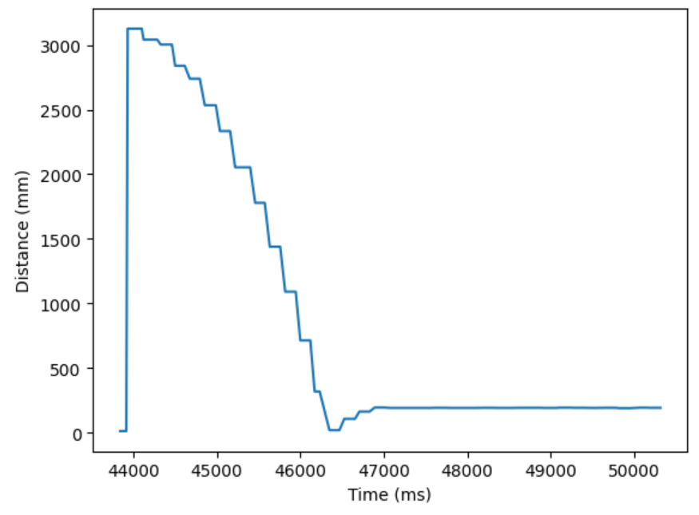
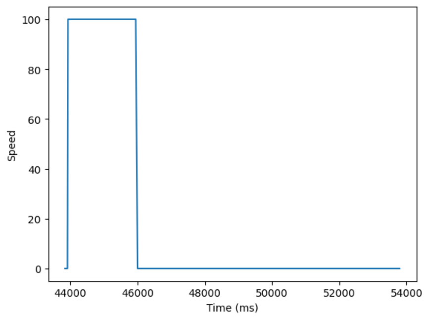
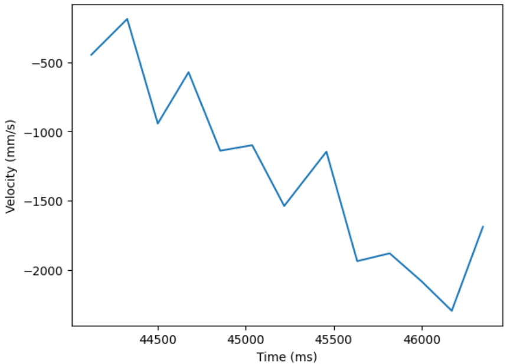
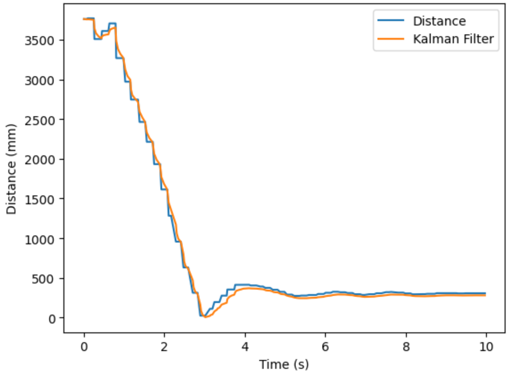
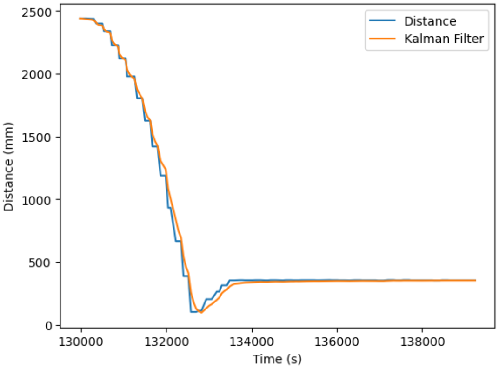

<section id="content">

<h2>Objective</h2>
In the previous lab 6, we programmed the car using closed-loop control (PID) to drive forward as fast as possible before stopping at exactly 1 foot distance from a wall. The speed of the car is limited by the sampling of the ToF sensors, as the car can only update its speed as fast as it receives new data. In lab 7, we implement a Kalman Filter to predict the location of the car and increase the speed that the car can perform its task.

<h2>Step Response</h2>
In order to design a Kalman Filter, we derive the A and B matrices from the step response of the car. From the step response, we find drag of the system as
<code><i>d = u/v</i></code>
and mass of the system as
<code><i>m = -dt(0.9)/ln(1-0.9)</i></code>
For the step response, the car was driven at a constant speed towards a wall in order to determine the steady-state velocity, or the maximum speed of the car once drag balances out with acceleration. We also determine the 90% rise time, representing the time it takes for the car to reach 90% of the steady state velocity. A PWM value of 100 was chosen to drive the car forward, based on the maximum speed reached in Lab 6 with a kp = 0.2 and the car starting 4000 mm away from the wall.

From the distance and speed data found by driving the car forward at a constant speed until hitting the wall, velocity data was determined and plotted using the following code. It was necessary to manipulate the distance and time arrays to have the same shape since the Artemis board clock updates time much more frequently than the ToF sensors can gather data.

<pre><code>dx = np.diff(distance)

dt = np.diff(time)

v = dx/dt
</code></pre>

The maximum velocity reached by the car was found to be -2296.51 mm/s, and by assuming u = 1 we found <i>d = u/v = 1/(-2296.51) = 0.000435</i>. The 90% step time required finding the time at which the car reaches <i>-2296.51 * 0.9 = -2066.859 mm/s</i>; this time was estimated from the data point (46000.0 ms, -2082.87292818 mm). Mass was determined as <i>m = -dt(0.9)/ln(1-0.9) = -(0.000435)((46000.0-43931.0)/1000)/ln(0.1) = 0.000391</i>.

<h2>Kalman Filter</h2>
Using these calculated values of drag and mass, we initialized the A and B matrices. The C matrix was initialized as C = [-1, 0] like in lecture because we are measuring negative distance from the wall.

<pre><code>d = 0.000435   # drag
m = 0.000391   # mass

# A, B, C matrices
A = np.array([[0,1],[0,-d/m]])
B = np.array([[0],[1/m]])
C = np.array([[-1,0]])

# Discretize A and B
dt = time_list[1] - time_list[0]
Ad = np.eye(2) + dt * A
Bd = dt * B
</code></pre>

The Kalman Filter depends on initial state, as well as process and sensor noise covariance matrices. These matrices represent our trust in the sensor measurements as opposed to the Kalman Filter itself. These values can be adjusted in the future depending on the effectiveness of the Kalman Filter in predicting the state of the car.

<pre><code># Process and sensor covariance matrices
sigma_u = np.array([[10**2,0],[0,10**2]])
sigma_z = np.array([[20**2]])

# Initial state
mu = np.array([[-distance_list[0]],[0]])
sigma = np.array([[5**2,0],[0,5**2]])
</code></pre>

<h2>Python Implementation</h2>
The Kalman Filter was first built in Python as a sanity check. The results of the filter were compared to the actual distance measurements found during Lab 6 while the car performed its task. As shown below, the Kalman Filter was able to accurately predict the physical measurements with minimal inaccuracy. The filter was not yet implemented in Arduino C code, which will instead be completed in Lab 8 in order to speed up the car as it performs its task without being bottlenecked by the speed of its sensors.

<pre><code># KF estimation
def kf(mu,sigma,u,y):
    
    mu_p = Ad.dot(mu) + Bd.dot(u)                      # predicted state
    sigma_p = Ad.dot(sigma.dot(Ad.transpose())) + sigma_u  # predicted state uncertainty
    
    sigma_m = C.dot(sigma_p.dot(C.transpose())) + sigma_z
    kkf_gain = sigma_p.dot(C.transpose().dot(np.linalg.inv(sigma_m)))  # KF gain
    
    y_m = y-C.dot(mu_p)
    mu   = mu_p + kkf_gain.dot(y_m)                   # new state 
    sigma = (np.eye(2) - kkf_gain.dot(C)).dot(sigma_p)  # new state uncertainty

    return mu, sigma
</code></pre>

<h2>Arduino Implementation</h2>
Using the <i>BasicLinearAlgebra.h</i> library, the Kalman filter was transposed from Jupyter notebook to Arduino code so the Kalman Filter estimation can be calculated directly on the Artemis board itself. The Kalman filter estimation is compared to the measured ToF sensor values in the below graph. It can be observed that the ToF sensor values are taken at a larger time interval compared to the smoother Kalman Filter curve.

<pre><code>void kf(){
    float u = speed/100;
    Matrix<2,1> mu_p = Ad * mu + Bd * u;
    Matrix<2,2> sigma_p = Ad * sigma * ~Ad + sigma_u;

    Matrix<1,1> sigma_m = C * sigma_p * ~C + sigma_z;
    Matrix<1,1> sigma_m_inverted = sigma_m;
    Invert(sigma_m_inverted);
    Matrix<2,1> kkf_gain = sigma_p * ~C * sigma_m_inverted;

    Matrix<1,1> y = {distance1};
    Matrix<1,1> y_m = y - C*mu_p;
    mu = mu_p + kkf_gain * y_m;
    sigma = (I - kkf_gain * C) * sigma_p;
}
</code></pre>

Finally, the task code was modified to speed up PID control. The speed of the motors were previously updated by a PID loop with an execution time that's limited by the sampling rate of the ToF sensors. The newly modified code uses ToF sensor measurements if they are available, and uses the Kalman Filter estimated distances instead when the sensors are not ready. This allows the robot to update its motor speed at a more rapid time interval.

<iframe width="320" height="560" src="https://www.youtube.com/embed/7AqaHDRCOZk" title="ECE 4160 Lab 7: Kalman Filter" frameborder="0" allow="accelerometer; autoplay; clipboard-write; encrypted-media; gyroscope; picture-in-picture; web-share" allowfullscreen></iframe>