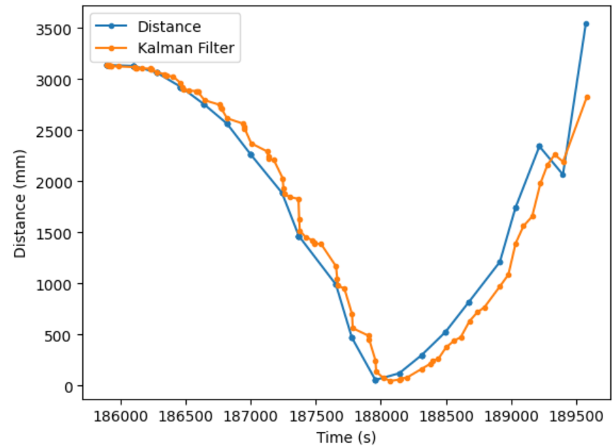
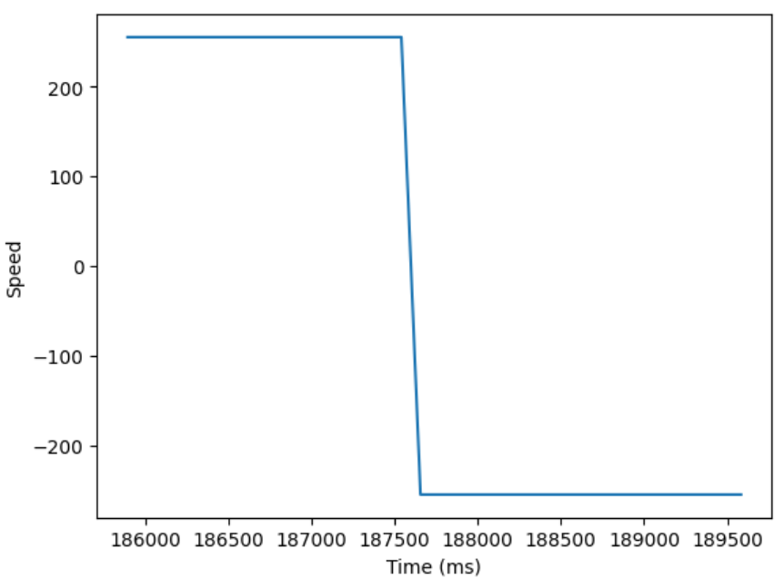

<section id="content">

<h2>Objective</h2>
The purpose of this lab is to combine the work done in previous labs to control the robot in a high speed stunt. The robot can be programmed to react to new information as quickly as it receives it, which is combined with a previously designed Kalman Filter to predict the robots position, effectively receiving new information faster than the sensors can sample new measurements. 

<h2>Task A: Position Control</h2>
For this lab, I was tasked with flipping the robot at a specified distance from the wall. More specifically, the goal was to drive the robot forward as fast as possible starting at a distance of 3 m from the wall. Then, at a distance of 0.5 m the robot is commanded to flip, then begin reversing until it crosses back over the starting line. 

In order to flip the robot, the car must drive in reverse as fast as possible directly after driving forward as fast as possible. I moved components from the back of the robot to the front in order to keep the car front heavy in the hopes that after gaining sufficient forward momentum, the back wheels of the car would pivot over the front wheels upon a sudden momemntum shift. A few alternative methods were implemnted in attempts to flip the car, such as hard braking the car upon reaching the set distance from the wall. However braking the car led to friction between the wheels and the ground that kept all four wheels firmly on the ground. Ultimately, the best stunts attempts were the result of driving the car forward, then in reverse immediately after reaching the set point. Below is my paraphrased code.

<pre><code>case TASK:
{
    //Initialize Kalman Filter from lab 7, and other variables ommitted for brevity
    mu = { -distance1,
            0 };
    sigma = { 5 ^ 2, 0,
              0, 5 ^ 2 };
    
    // ...

    int stop_time = currentMillis + 5000;
    while (millis() <= stop_time) {

        //At every loop, attempt to gather sensor data and perform Kalman Filter calculations.
        getSensorData();
        kf();

        //If new sensor data is available use it, otherwise use Kalman Filter estimate of distance
        if (sensor_success) {
            error = distance1 - point;
        } else {
            error = -1 * mu(0, 0) - point;
        }

        //Before the car gets flipped, drive it as fast as possible until it is a certain distance from the wall
        if (!flipped) {
            if (error > 0) {
                forward(speed);
            }
            //When it reaches said distance, drive in reverse for 2000 milliseconds
            //I turned the LED on in order to get a sense of how quickly the car can react to being past the set point
            else {
                speed = -speed;
                reverse(-speed);
                digitalWrite(LED_BUILTIN, HIGH);
                stop_time = millis() + 2000;
                flipped = true;
            }
        }

        //Continue to reverse for the remainder of the task
        if (flipped) {
            reverse(-speed);
        }

        //Send data over bluetooth and python, paraphrased for brevity
        tx_estring_value.clear();
        int time = millis();
        tx_estring_value.append("Time (ms): ");
        tx_estring_value.append(time);
        tx_characteristic_string.writeValue(tx_estring_value.c_str());

        //...

        }

    //Stop the robot after sufficient time has passed
    stop();
    digitalWrite(LED_BUILTIN, LOW);
    Serial.println("Task Complete");
    break;
    }

</code></pre>

Note that PID control was not utilized since in order to perform the stunt, the robot must be moving at nearly maximum speed, while PID control is used to slow down the robot as it approaches a set point. The Kalman Filter designed in Lab 7 however was important to use; at high speeds the car often overshoots the set point, and since the Kalman Filter predicts position faster than the ToF sensors can measure, basing the control of the car off the estimated distance lets us perform the stunt at a more accurate distance. In spite of this, the set point still had to be increased from 0.5 m to 1 m so the car has ample time to flip without crashing into the wall.

<h2>Stunts</h2>
Unfortunately, I was unsuccessful in flipping the robot. Due to imbalances in my left and right motors, the right side of my car accelerates and decelerates much quicker than the left side. As a result, driving the car at maximum speed (PWM value of 255) would result in the right motor overpowering the left motor, and the car spinning in a circle instead of driving forward. The below video shows the car when driving both motors with a PWM signal = 255.

<iframe width="320" height="560" src="https://www.youtube.com/embed/cdrUaW3QyGE" title="ECE 4160 Lab 8: Driving Forward?" frameborder="0" allow="accelerometer; autoplay; clipboard-write; encrypted-media; gyroscope; picture-in-picture; web-share" allowfullscreen></iframe>

To rectify the motor imbalance I had to decrease the right motor speed by a factor of 0.5. This slowed down the car enough so that it could not gain sufficient momentum in time to overcome gravity, and although I have some recordings of the back half of the car lifting off of the ground, I was never able to fully flip the robot.

<iframe width="320" height="560" src="https://www.youtube.com/embed/LHxgUiBraLI" title="ECE 4160 Lab 8: Attempt 1" frameborder="0" allow="accelerometer; autoplay; clipboard-write; encrypted-media; gyroscope; picture-in-picture; web-share" allowfullscreen></iframe>

<iframe width="320" height="560" src="https://www.youtube.com/embed/sCd5v6gL3_0" title="ECE 4160 Lab 8: Attempt 2" frameborder="0" allow="accelerometer; autoplay; clipboard-write; encrypted-media; gyroscope; picture-in-picture; web-share" allowfullscreen></iframe>

<iframe width="320" height="560" src="https://www.youtube.com/embed/gQHFBI98T90" title="ECE 4160 Lab 8: Attempt 3" frameborder="0" allow="accelerometer; autoplay; clipboard-write; encrypted-media; gyroscope; picture-in-picture; web-share" allowfullscreen></iframe>