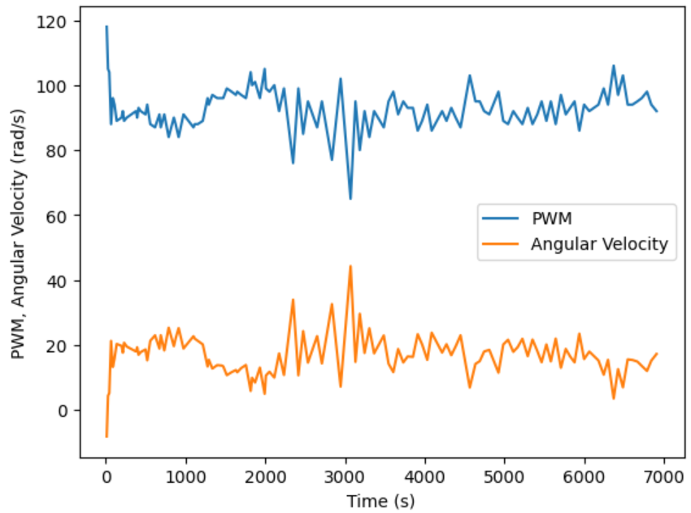
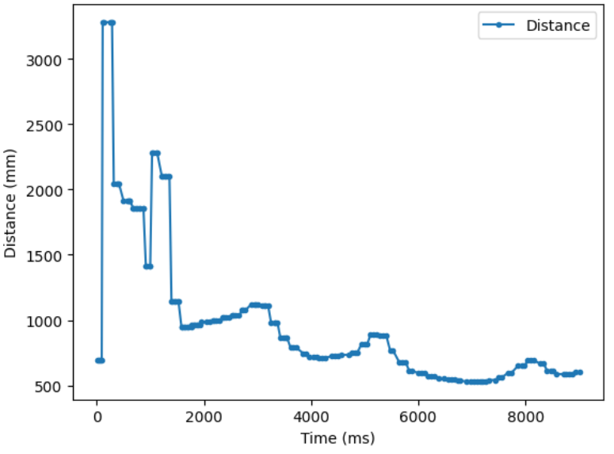
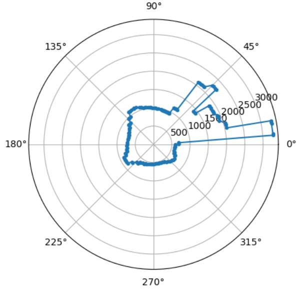
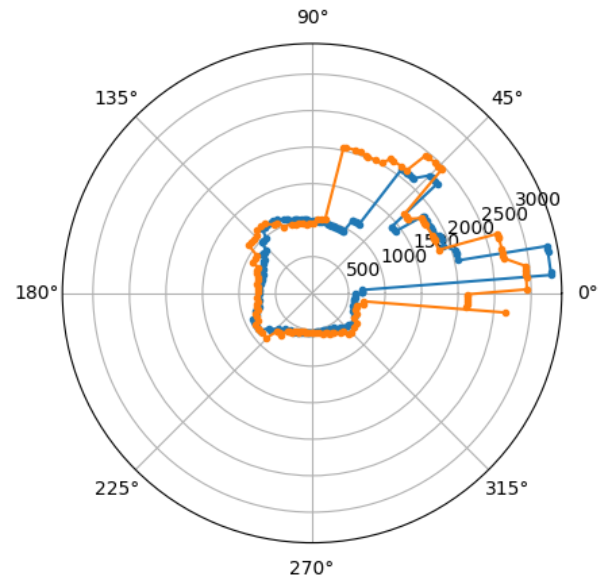
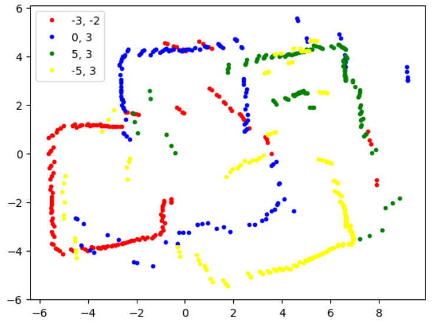
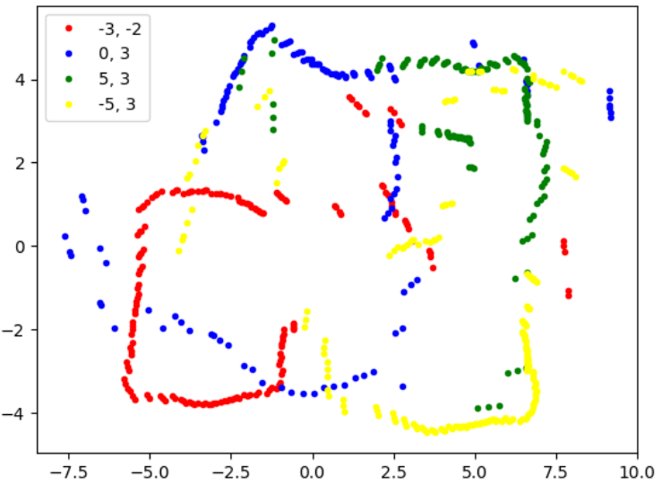
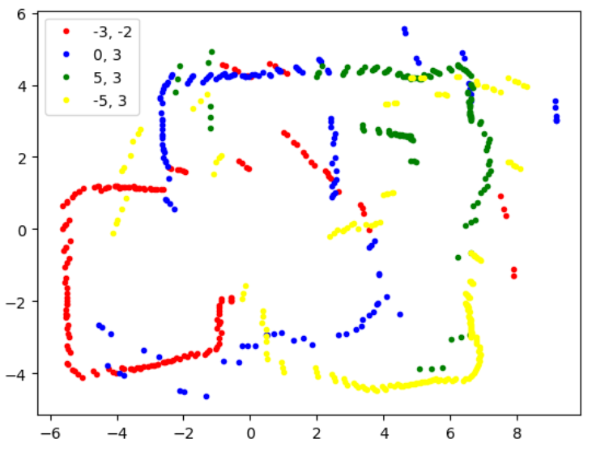
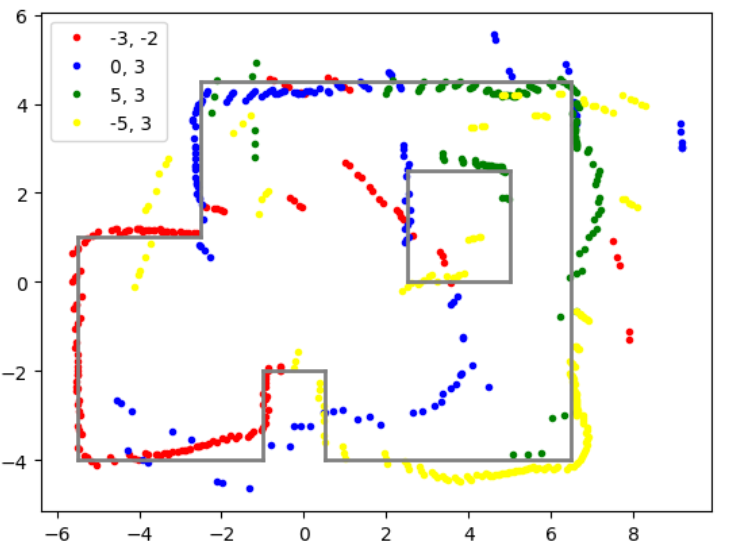

<section id="content">

<h2>Objective</h2>
In this lab, we map out a room using distance measurements sampled from different locations within the room. At each marked location we use PID control to slowly rotate the robot while gathering distance data. Using transformation matrices to merge together these 360 degree distance measurements, we can build a map of the room to be used in future labs.

<h2>Control</h2>
I chose to rotate the robot using closed-loop control on the robots raw gyroscope readings, with the goal of rotating the robot at a constant angular velocity about the z axis. I based my decision based on the fact that closed-loop control is more robust than open-loop control, and the rotational speed of the robot is less dependent on factors such as battery charge or floor friction. In open-loop control, the speed of the robot is calibrated based on specific battery and floor conditions, while in closed-loop control the robot will speed up or slow down to compensate for environmental factors. Another design choice was to feed the control loop feedback based on angular velocity rather than orientation because I discovered in Lab 4 that my orientation calculation for yaw resulted in a large amount of drift. This drift results from the integration of angular velocity from the gyroscope; although it is possible to correct this drift by utilizing the other sensors on the IMU, my IMU magnetometer and accelerometer did not output accurate nor reliable enough readings to use as correction factors.

When I first tried to implement PID control, I found that my yaw values from the gyroscope were very noisy and inaccurate. I solved this by implementing a low pass filter to smoothen out my gyroscope readings. Below is a description of my code implementation.

<pre><code>// Low Pass Filter
myICM.getAGMT();
yaw_g = myICM.gyrZ();
yaw_g_LPF[n] = alpha*yaw_g + (1-alpha*yaw_g_LPF[n-1]);
yaw_g_LPF[n-1] = yaw_g_LPF[n];
yaw_g = yaw_g_LPF[n];
</code></pre>

<pre><code>// PID Controller
dt_task = millis() - last_time_task;
error = yaw_g - point;
integral = integral + (error * dt_task);
derivative = (error - prev) / dt_task;
pid = Kp * error + Ki * integral + Kd * derivative;
prev = error;
last_time_task = millis();

speed = min_speed - pid;
if (speed > max_speed) speed = max_speed;
right(speed);
</code></pre>

After extensive testing, I settled on my PID gain values at Kp = 0.25, Ki = 0 and Kd = 0.1. I first found a positional gain term that keeps the robot rotating at a roughly constant speed. The robot has a tendency to oscillate around the desired rotation speed because it takes a significant period of time for the motors to accelerate to terminal speed. As a result, the robot would notice itself moving slowly and overshoot its desired speed, and once the robot finishes accelerating and realizes its mistake it will overshoot its correction and drastically slow down. To remedy this, I introduced a very large derivative gain factor to discourage the robot from sharp changes in speed. I chose to omit an integral gain to avoid integrator wind-up, and because the desired behavior is to not only reach the setpoint angular velocity but also to stay at that constant speed.

<iframe width="320" height="560" src="https://www.youtube.com/embed/ZqusyX0Yf-o" title="ECE 4160 Lab 9: Rotation" frameborder="0" allow="accelerometer; autoplay; clipboard-write; encrypted-media; gyroscope; picture-in-picture; web-share" allowfullscreen></iframe>

My setpoint for PID control was an angular velocity of 20 rad/s, and as seen in the above graph the robot attempts to oscillate around this rotational speed. I found that at too low of a setpoint, the left set of wheels would stop spinning much sooner than the right set of wheels. As a result, the car would either spin along a large axis because the right set of wheels would drive forward and pivot around the left set of wheels, or the car would stop spinning completely because the right wheels did not have enough power to overcome the friction of the braked left set of wheels. I improved this issue by resoldering the two motor drivers, but this was still a limiting factor that stopped me from rotating the robot at extremely low speeds. Slowing down the rotation speed of the car would increase the number of ToF sensor measurements I could collect in one rotation, but these measurements would be less accurate due to the increased axis of rotation. Note that since the IMU is mounted at the front of the car rather than the center, there is some slight errors regardless resulting from the nonzero distance between the IMU and axis of rotation. In an empty, square 4x4 m^2 room, the ToF measurement is inaccurate by at least this distance of approximately 50 mm.

<h2>Read out Distances</h2>
Once I verified that I could rotate the car at a nearly constant speed, it was time to gather distance data. I placed the car at various marked spots around the lab with consistent starting orientation and gathered distance data during one full rotation. Next, I converted the cartesian distance data into polar coordinates to roughly map out the room from the perspective of the robot at the marked location.

I also wanted to ensure that the robot's readings were consistent across multiple trials, especially since the robot's rotational speed is not perfectly constant. To do so I plotted the results of two trials, and found that they were roughly equivalent.

<h2>Merge and Plot Readings</h2>
After collecting distance data from different points in the lab, the next step is to merge these readings into a map. I converted the readings of the robot from the original frame of reference based on the ToF sensor position to the inertial reference frame of the room. Since the ToF sensor is mounted on the front of my robot with an offset of approximately 50 mm, I included this offset when converting the polar distance readings to cartesian coordinates. I also had to convert the ToF measurements from millimeters to feet.

<pre><code>#Inspiration from Ryan Chan's GitHub Page, https://pages.github.coecis.cornell.edu/rc627/ECE-4960/lab9.html
def plot(distances,theta,x_origin,y_origin,color,label):
    x = []
    y = []
    for i in range(len(distances)):
        angle = (theta[i])/360 * (2 * np.pi)

        x.append((distances[i] + 50)*0.00328084 * np.cos(angle) + x_origin)
        y.append(distances[i] * np.sin(angle)*0.00328084 + y_origin)
        
    plt.plot(x,y, '.', color=color, label = label)

</code></pre>

In the above image, I used theta values that were measured and calculated directly by integrating the yaw values sent from the IMU gyroscope. I was worried that this value would not be accurate due to noise in the sensor readings, so I also tried to calculate theta directly using time measurements and assuming the car was rotating at a constant angular velocity.

<pre><code>ratio = (2*np.pi)/time[-1]
angle =(time[i]*ratio)
</code></pre>

This strategy improved some of my trial results but worsened the legibility of others. Calculating theta is reliant on the assumption that the car is rotating at a constant speed, and if the PID controller ends up oscillating the angular velocity of the robot, it is not safe to assume that time and angle are directly proportional. Thus for my final merged plot, I combined both strategies.

<h2>Convert to Line-Based Map</h2>

To convert the map into a format usable by the simulator, I manually drew lines on the map based on the sensor measurements that roughly correspond to the walls and obstacles in lab.

<pre><code>x_walls = [-5.5, -1, -1, 0.5, 0.5, 6.5, 6.5,-2.5, -2.5, -5.5, -5.5]
y_walls = [-4, -4, -2, -2, -4, -4, 4.5, 4.5, 1, 1, -4]
x_box = [2.5, 5, 5, 2.5, 2.5]
y_box = [2.5, 2.5, 0, 0, 2.5]
</code></pre>

